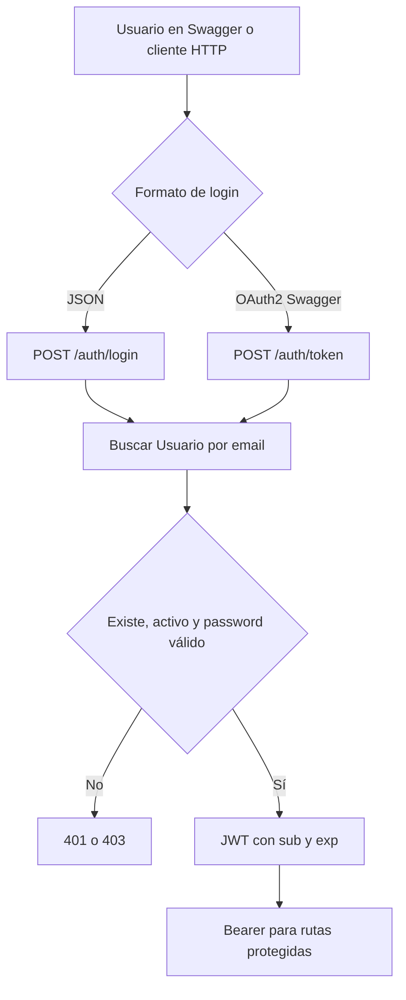
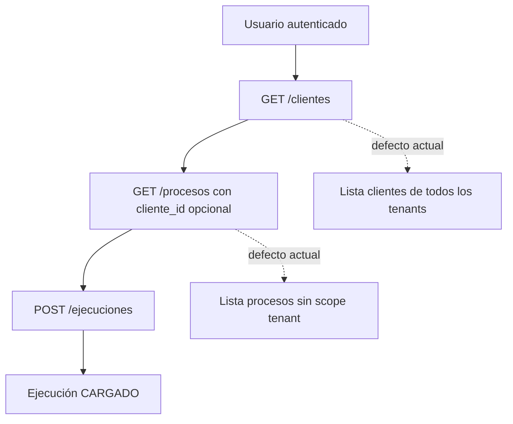
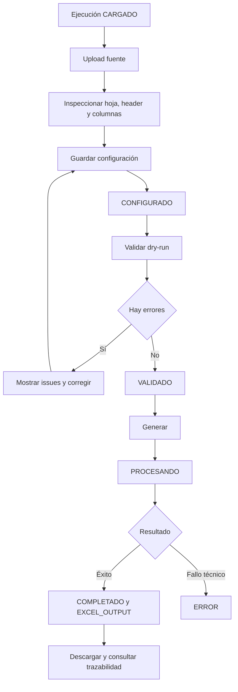
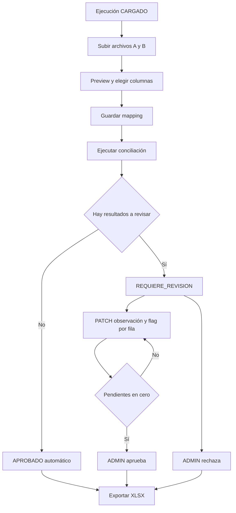

# Reporte de diseño de producto y sistema de `automatizador-admin`

**Fecha de auditoría:** 2026-08-04  
**Alcance:** diseño comprobado en el working tree actual y evolución recomendada  
**Regla:** lo propuesto se etiqueta como futuro; no se presenta como funcionalidad existente

## Índice

1. [Resumen del producto](#1-resumen-del-producto)
2. [Visión del sistema](#2-visión-del-sistema)
3. [Usuarios y roles](#3-usuarios-y-roles)
4. [Casos de uso](#4-casos-de-uso)
5. [Flujos principales](#5-flujos-principales)
6. [Diseño funcional actual](#6-diseño-funcional-actual)
7. [Diseño de la transformación Excel](#7-diseño-de-la-transformación-excel)
8. [Interfaz y experiencia de usuario](#8-interfaz-y-experiencia-de-usuario)
9. [Arquitectura de información propuesta](#9-arquitectura-de-información-propuesta)
10. [Estados del sistema](#10-estados-del-sistema)
11. [Decisiones de diseño detectadas](#11-decisiones-de-diseño-detectadas)
12. [Principios de diseño recomendados](#12-principios-de-diseño-recomendados)
13. [Escalabilidad funcional](#13-escalabilidad-funcional)
14. [Diseño futuro recomendado](#14-diseño-futuro-recomendado)
15. [Próximos objetivos del proyecto](#15-próximos-objetivos-del-proyecto)
16. [Riesgos de producto y diseño](#16-riesgos-de-producto-y-diseño)
17. [Temas para trabajar con el tutor](#17-temas-para-trabajar-con-el-tutor)
18. [Información no verificada](#18-información-no-verificada)

## 1. Resumen del producto

### 1.1 Problema principal

El producto busca convertir tareas administrativas basadas en archivos en procesos repetibles: asociar un proceso a un cliente, crear una ejecución, cargar fuentes, aplicar reglas controladas, pedir intervención humana cuando corresponda y producir un resultado (`docs/PROJECT_ROADMAP.md`, secciones “Visión del producto” y “Alcance funcional”).

El código comprueba dos problemas concretos:

- **Conciliar dos planillas:** identificar coincidencias/diferencias por una clave e importe, revisar excepciones y exportar (`backend/app/services/conciliacion_service.py`).
- **Transformar una planilla:** seleccionar, convertir, concatenar, calcular o mapear columnas; filtrar/deduplicar/ordenar; validar y generar un XLSX (`backend/app/schemas/transformacion_excel.py`, `backend/app/services/transformacion_excel_pipeline.py`).

### 1.2 Usuarios previstos

El repositorio modela usuarios ligados a un cliente y un rol textual, pero no documenta personas formales. Se pueden inferir con evidencia:

- Administrador que gestiona clientes/procesos y aprueba/rechaza.
- Usuario autenticado que crea ejecuciones, carga/configura/ejecuta y revisa.
- Operador administrativo implícito (el test integral usa el string `OPERADOR`, no un enum).
- Desarrollador/usuario técnico que hoy maneja Swagger y JSON complejos.

“Cliente” es una entidad, no un actor autenticado separado. No está resuelto si ADMIN es de plataforma o de tenant.

### 1.3 Valor actual

- Reglas explícitas en vez de scripts arbitrarios por archivo.
- Pipeline determinista y reutilizable para transformación.
- Dry-run antes de generar.
- Resultados/errores estructurados para futura UI.
- Revisión humana en conciliación.
- Plantillas por proceso y trazabilidad acotada en transformación.

El valor todavía depende de una persona técnica: no existe frontend, gestión de usuarios, onboarding ni runbook de operación.

### 1.4 Alcance actual y futuro documentado

| Alcance | Estado real |
| --- | --- |
| Backend clientes/procesos/ejecuciones/archivos | Implementado parcialmente |
| Conciliación CSV/XLS/XLSX | Implementada, con debilidades de diseño/seguridad y sin tests |
| Transformación CSV/XLS/XLSX a XLSX | Implementada y cubierta unitariamente |
| Frontend | Próximo bloque explícito del roadmap; sin alcance técnico/UX |
| PDF/OCR | Excluido del MVP; upload solo almacena PDF |
| Inteligencia artificial | No aparece en código, dependencias, handoff ni roadmap; aspiración externa no verificada |

## 2. Visión del sistema

### 2.1 Visión documentada

El roadmap define una plataforma web multicliente:

```text
Cliente → Proceso configurado → Ejecución → Archivos → Inspección/validación
→ Reglas → Procesamiento → Revisión humana → Archivo/resultado
```

Principios explícitos para Transformación Excel: configuración antes de ejecutar, determinismo, fuente inmutable, salida trazable, errores claros, reglas limitadas y no ampliar esquema por defecto (`docs/PROJECT_ROADMAP.md`).

### 2.2 Producto real existente

La cadena de entidades y los dos motores existen, pero la experiencia no es una “plataforma web” para usuarios finales. Es una API operada por Swagger:

- El tenant está en el modelo, pero no en toda la autorización.
- La configuración de conciliación reusable prometida no se conecta al runtime.
- La intervención humana solo existe sobre filas de conciliación.
- La trazabilidad operativa avanzada solo existe en transformación.
- No hay navegación, tablero, notificaciones, asignación de trabajo ni historial uniforme.

### 2.3 Diferencia clave

La visión tiene un **modelo de producto común** para muchos procesos; la implementación tiene **dos verticales con reglas distintas** sobre tablas compartidas. Los endpoints por ejecución/plantilla de Transformación validan tipo/tenant y aplican algunas guardas de estado, todavía inconsistentes; su inspección de estructura valida tenant/formato, no tipo de proceso. Conciliación no valida tipo/tenant/estado y usa servicios más antiguos. Antes de presentar ambos como una plataforma homogénea, hay que definir el contrato transversal: identidad, permisos, ejecución, archivo, configuración, evento y resultado.

### 2.4 Futuro verificable frente a aspiración

- **Verificado como próximo objetivo:** frontend.
- **Áreas técnicas listadas como posibles, no automáticamente autorizadas:** permisos avanzados, migraciones, deployment e historial/auditoría; algunas descargas/plantillas/tests que el bloque histórico menciona ya existen.
- **Fuera del MVP:** extracción PDF/OCR y automatizaciones programadas.
- **No verificado en repositorio:** IA.

## 3. Usuarios y roles

| Actor/persona | Objetivos | Acciones actuales | Información necesaria | Restricciones reales | Faltantes |
| --- | --- | --- | --- | --- | --- |
| Usuario activo no ADMIN | Ejecutar un proceso y obtener/revisar resultado | Crear/listar ejecuciones; subir/preview; mapping/ejecutar/revisar conciliación; configurar/validar/generar transformación; aplicar plantillas | Cliente/proceso, archivos, estructura, config, issues, resultado | JWT y `Usuario.estado=ACTIVO`; tenant solo se exige en transformación | UI, onboarding, scoping consistente, historial propio, cambio de contraseña |
| ADMIN | Administrar y aprobar | CRUD cliente/proceso; PATCH/cancelar ejecución; aprobar/rechazar; crear/editar/desactivar plantillas | Recursos administrables, pendientes, auditoría | Comparación exacta `rol == ADMIN`; global en rutas legacy, tenant-local en transformación | Definir admin global vs tenant; usuarios/roles; auditoría |
| Operador administrativo | Completar tareas sin programar | **Implícito**, coincide con usuario no admin | Guía paso a paso, preview, errores comprensibles | El rol `OPERADOR` solo aparece en tests; no está validado/modelado | Persona, permisos y pantallas formales |
| Revisor/aprobador | Resolver excepciones de conciliación | PATCH fila; ADMIN aprueba/rechaza | Cola de pendientes, contexto A/B, motivo, actor/historial | No es rol propio; revisión no registra actor y no hay paginación | Workflow, asignación, acciones masivas, segregación de funciones |
| Configurador de proceso | Definir reglas reutilizables | Usuario configura una ejecución; ADMIN crea plantilla desde ella | Columnas, tipos, reglas, preview/dry-run | No existe entidad/permiso separado; JSON técnico | Editor usable, versionado, borrador/publicación, impacto |
| Usuario técnico/desarrollador | Levantar y operar el backend | Swagger, scripts, DB y filesystem | IDs, schemas, env, estado interno | Es la única forma viable hoy | README/runbook, herramientas de soporte, observabilidad |
| Cliente | Ser dueño lógico de datos/procesos | No actúa por sí mismo; es entidad `Cliente` | Sus usuarios/procesos/archivos | No es rol ni cuenta | Decidir si se selecciona o es contexto implícito |

No existe CRUD `/usuarios`, registro, invitación, recuperación de contraseña, desactivación de sesiones ni administración de permisos. La gestión de usuarios que el roadmap marca como completada es **parcial**.

## 4. Casos de uso

### 4.1 Casos actuales

| Caso / objetivo | Actor | Precondiciones | Flujo principal | Errores relevantes | Resultado | Estado |
| --- | --- | --- | --- | --- | --- | --- |
| Iniciar sesión | Usuario | Usuario seed/manual en DB, activo | Enviar email/password; recibir bearer y perfil | Credencial inválida; inactivo; secreto inseguro | Token temporal | Implementado |
| Consultar identidad | Usuario | JWT válido | `GET /auth/me` | 401/403 | Datos sin hash | Implementado |
| Administrar cliente | ADMIN | Login | Listar/crear/editar/inactivar | 404; errores DB; acceso global ambiguo | Cliente persistido/inactivo | Parcial |
| Administrar proceso | ADMIN | Cliente existente | Crear/editar/inactivar | Cliente inexistente; tipo libre; tenant | Proceso persistido | Parcial |
| Crear ejecución | Usuario | Proceso existente | Seleccionar `proceso_id`, crear `CARGADO` | Puede ser inactivo/ajeno; 400 si no existe | Ejecución ligada al usuario | Parcial |
| Cargar archivo | Usuario | Ejecución existente | Multipart, guardar original, registrar metadata | Extensión; I/O; sin límite/tenant | `Archivo` + fichero local | Parcial |
| Previsualizar archivo | Usuario | Archivo CSV/XLS/XLSX físico | Parsear y devolver columnas/filas | Extensión/parseo/memoria/path | Preview | Parcial |
| Configurar conciliación | Usuario | Dos archivos en una ejecución | Elegir claves/importes/tolerancia; guardar mapping | Archivo/columnas; no tipo/estado/tenant | Mapping en `resumen_json` | Parcial |
| Ejecutar conciliación | Usuario | Mapping y archivos legibles | Normalizar, duplicados, comparar, guardar resultados | Fuente/formato; carrera; rerun destructivo | Resultados + resumen; aprobación automática o revisión | Parcial |
| Revisar conciliación | Usuario/ADMIN | Resultado existente | Editar observación/flag, ver resumen | Sin actor/estado/tenant | Pendiente marcado resuelto o anotado | Parcial |
| Aprobar/rechazar | ADMIN | Resultados para aprobar; rechazo no exige resultados | Validar pendientes o guardar rechazo | Estado previo no validado | `APROBADO`/`RECHAZADO` | Parcial |
| Exportar conciliación | Usuario | Al menos un resultado | Generar hojas y descargar XLSX | I/O; fórmula; sin registro de output | Archivo local no registrado, sobrescrito en cada export | Parcial |
| Inspeccionar fuente de transformación | Usuario tenant | CSV/XLS/XLSX asociado a su tenant | Elegir hoja/header, revisar estructura | Ruta, tamaño, ZIP, columnas | Modelo de fuente para configurar | Implementado |
| Configurar transformación | Usuario tenant | Ejecución de tipo correcto y fuente propia | Definir columnas/reglas/salida | Schema/columnas/estado; carrera `PROCESANDO` | Snapshot `CONFIGURADO` | Implementado con defecto |
| Validar transformación | Usuario tenant | Config guardada | Ejecutar dry-run y revisar métricas/issues/preview | Datos, integridad, límites | `VALIDADO` o `CONFIGURADO` | Implementado |
| Generar/descargar transformación | Usuario tenant | Validación vigente | Reservar, generar, registrar y descargar | 409 integridad/estado; I/O; fórmula header | XLSX trazable `COMPLETADO` | Implementado con límites |
| Reutilizar plantilla | Usuario/ADMIN | Config y proceso de transformación | ADMIN crea; usuario lista/aplica | Tenant, proceso, inactiva, nombre | Config reutilizada sin archivo fijo | Implementado |
| Diagnosticar transformación | Usuario tenant | Ejecución existente | Consultar resumen y traza | JSON histórico inválido; archivo ausente | Acción requerida e issues | Implementado |

### 4.2 Casos futuros documentados o recomendados

| Caso / objetivo | Actor | Precondiciones | Flujo principal | Errores o riesgos | Resultado esperado | Estado |
| --- | --- | --- | --- | --- | --- | --- |
| Usar el sistema sin Swagger | Operador | Roles, tenant y API estabilizados | Login, wizard, preview, validación y seguimiento | Permisos/estados inconsistentes o error técnico no traducido | Ejecución y resultado desde una UI guiada | Planeado por roadmap; diseño no definido |
| Administrar usuarios | Admin por definir | Política de roles/tenant y backend de usuarios | Invitar, asignar rol, desactivar y restablecer acceso | Escalada de privilegios, cuenta duplicada o tenant equivocado | Ciclo de vida de cuentas administrable | Documentado como alcance, no implementado |
| Consultar historial operativo uniforme | Operador/soporte | Modelo de eventos y configuración versionada | Filtrar ejecuciones, cambios, archivos y errores | Evento incompleto, truncado o no atribuible | Historia explicable por ejecución | Recomendado; parcialmente existe en transformación |
| Procesar en segundo plano | Operador | Cola, workers, idempotencia y recuperación | Crear job, ver progreso, reintentar o cancelar | Duplicación, timeout, worker caído o estado huérfano | Trabajo durable fuera del request | Recomendado según escala; no planeado formalmente |
| Procesar PDF/OCR | Por definir | Caso aprobado, muestras, precisión y privacidad | Ingestar, extraer y validar con intervención humana | Formato no soportado, baja precisión o dato sensible | Datos estructurados revisables | Excluido del MVP; futuro no comprometido |
| Realizar análisis con IA | Por definir | Problema, datos, evaluación y gobernanza | Flujo aún por especificar con fallback humano | Alucinación, privacidad, costo o indisponibilidad | Resultado medido y revisable, aún sin contrato | No verificado en repositorio |

## 5. Flujos principales

### 5.1 Inicio de sesión actual



No existe pantalla de login, refresh, recuperación ni logout.

### 5.2 Selección de cliente/proceso y creación



No hay “selección” persistida ni UI. Para un usuario de tenant, idealmente el cliente debería ser contexto derivado, no una lista global.

### 5.3 Flujo de transformación actual



El diagrama representa endpoints existentes. El “mostrar/corregir” se hace hoy leyendo JSON en Swagger.

### 5.4 Flujo de conciliación e intervención manual



El código no exige el orden representado: mapping/ejecución/revisión/rechazo pueden invocarse en estados o tipos incorrectos. El flujo es la intención funcional, no una máquina enforceada.

### 5.5 Manejo de errores

Transformación ofrece issues, `action_required` y trazas. Conciliación usa HTTP 400/404/500, `error_message` y resultados con `requiere_revision`. No hay notificaciones, retry, recuperación automática ni cola de errores; el operador debe interpretar respuestas manualmente.

## 6. Diseño funcional actual

### 6.1 Clientes y procesos

`Cliente` agrupa usuarios y procesos. `Proceso` contiene nombre, tipo, descripción y estado. La relación representa bien el catálogo por cliente, pero:

- tipos/estados no están restringidos;
- no hay scoping transversal;
- procesos/clientes inactivos siguen apareciendo y algunas acciones continúan disponibles;
- no hay metadata de versión, dueño operativo, SLA o esquema de entrada/salida.

### 6.2 Configuraciones

Hay tres conceptos superpuestos:

1. **Configuración reusable de proceso:** sugerida por `ConfiguracionProceso` y el roadmap.
2. **Plantilla:** uso real de `ConfiguracionProceso` en transformación, identificada por discriminador dentro de JSON.
3. **Snapshot de ejecución:** mapping y transformación almacenados dentro de `EjecucionProceso.resumen_json`.

El seed crea una “Configuración inicial Conciliación Excel”, pero conciliación nunca la lee; crea un mapping nuevo por ejecución. Esto hace que “gestión de configuraciones completada” sea parcial.

### 6.3 Ejecución y resultados

`EjecucionProceso` es el agregado común. Almacena estado, tiempos, error y resumen; `Archivo` aporta entradas/salidas y `ResultadoConciliacion` representa resultados fila a fila. Ventaja: todos los procesos comparten una estructura mínima. Desventaja: estados y JSON de dos bounded contexts se mezclan sin discriminación fuerte.

Transformación registra output como `Archivo`; conciliación genera un XLSX al solicitarlo y no registra ese output. Transformación tiene checksums/config snapshot/traza; conciliación no tiene equivalentes completos.

### 6.4 Rígido frente a configurable

| Elemento | Configurable | Codificado rígidamente |
| --- | --- | --- |
| Proceso | Nombre, descripción, tipo string | Routers/servicios por tipo conocidos |
| Conciliación | IDs/columnas, tolerancia, detectar duplicados | Dos archivos, una clave/importe por lado, clasificación, estados, export sheets |
| Transformación | Fuente/hoja/header, columnas, cinco operaciones, filtros, dedupe, sort, output | Cinco operaciones, límites 5/3, orden del pipeline, único archivo fuente y XLSX output |
| Storage | Nada | Rutas locales `backend/storage/originals/{id}` y `backend/storage/processed/{id}` |
| Estados | Técnicamente string/PATCH | Servicios esperan valores concretos dispersos |
| Seguridad | Límites Excel por env | Tenant desigual, rol ADMIN literal |

La transformación tiene buen grado de reutilización para un ETL controlado. Conciliación es específica pero reutilizable si se formalizan config, tenant y estado.

## 7. Diseño de la transformación Excel

### 7.1 Modelo mental que necesita el usuario

El usuario debe comprender:

- una fuente (archivo, hoja, fila de encabezado);
- columnas de salida ordenadas;
- operación y tipo para cada columna;
- reglas sobre filas;
- opciones del workbook final;
- diferencia entre guardar una configuración de ejecución y crear una plantilla.

En JSON esto exige conocimiento técnico alto. La inspección, el schema discriminado y el dry-run ofrecen los datos necesarios para ocultar esa complejidad detrás de controles guiados.

### 7.2 Experiencia actual

1. Inspección devuelve hojas, tipos sugeridos, nulos, filas y warnings.
2. El usuario escribe manualmente `TransformacionExcelConfig`.
3. El backend valida forma y columnas.
4. Dry-run devuelve métricas, preview, errors y warnings con muestras.
5. El usuario reenvía una configuración corregida.
6. Generación produce/descarga output y resumen indica siguiente acción.

Esto está implementado, pero no hay editor, comparación visual fuente/salida, autoguardado, borrador o documentación contextual en UI.

### 7.3 Feedback necesario en un frontend futuro

- Mostrar archivo/hoja/header y preview antes de configurar.
- Crear columnas con selector de operación y campos condicionales.
- Sugerir tipo, sin asumir que la inferencia es correcta.
- Validar en cliente y siempre repetir validación servidor.
- Separar errores bloqueantes de warnings aceptables.
- Mostrar conteos y muestras con número real de fila fuente.
- Comparar preview de entrada y salida.
- Explicar filas filtradas/deduplicadas y política de no mapeados.
- Bloquear generar hasta `can_generate=true`.
- Mostrar `action_required` y recuperación ante fuente/config cambiada.
- Pedir confirmación al reemplazar una config validada o aplicar plantilla.

### 7.4 Configuraciones inválidas y casos complejos

Existente:

- Pydantic rechaza operaciones/campos desconocidos, posiciones/nombres duplicados de salida y referencias internas inválidas de deduplicación/orden; el servicio contrasta las columnas fuente con el archivo inspeccionado.
- Dry-run persiste issues y no permite generar con errores.
- El checksum invalida cambios de fuente/configuración antes de una generación normal; la reutilización temprana de una ejecución ya `COMPLETADO` no vuelve a validar la fuente.

No resuelto o frágil:

- headers fuente duplicados/vacíos parciales;
- `date_format` parece formato de salida, no pauta de parseo;
- locale/encoding/delimitador configurables;
- boolean como tipo de salida;
- límites de complejidad de config;
- preview de resultados grandes/paginado;
- versionado/publicación/rollback de plantillas;
- concurrencia durante `PROCESANDO`;
- transformaciones encadenadas o varias fuentes, explícitamente fuera del MVP.

### 7.5 Guardado y reutilización

La ejecución conserva su snapshot; el ADMIN puede crear una plantilla que elimina `archivo_id`, y luego otro usuario la aplica a una fuente del mismo proceso. Es una buena decisión para evitar atar plantilla a archivo. Falta versionado: editar reemplaza el JSON, el nombre único es app-side y no hay historial de quién creó/modificó.

## 8. Interfaz y experiencia de usuario

### 8.1 Estado comprobado

No existe frontend, código HTML/JS/TypeScript, `package.json`, diseño visual ni cliente dedicado. Swagger y ReDoc son las únicas interfaces. No hay CORS configurado.

Operaciones que hoy dependen de Swagger/API:

- login y bearer;
- lectura/creación de clientes, procesos y ejecuciones;
- multipart upload;
- inspección/preview;
- armado manual de mappings/config JSON;
- dry-run y lectura de issues;
- revisión fila a fila por IDs;
- generación, trazabilidad y descarga.

### 8.2 Problemas de usabilidad actuales

- IDs numéricos sustituyen selección contextual.
- Configuración de transformación exige editar JSON complejo.
- No hay progreso, loading ni retry. `DELETE /ejecuciones/{id}` solo fija `CANCELADO`; no detiene cooperativamente un procesamiento en curso.
- No hay navegación de vuelta desde resultado a cliente/proceso.
- Listados/resultados no paginan ni buscan.
- Estados de dos dominios se mezclan y se pueden cambiar manualmente.
- Errores no siguen un contrato uniforme; algunos son frases, otros códigos/issues.
- No existe control de accesibilidad, responsive, idioma, zona horaria ni formatos locales.
- La ruta de storage aparece en `ArchivoRead`, dato interno irrelevante para usuario.

### 8.3 Estructura mínima de pantallas propuesta

Propuesta futura, condicionada a resolver roles/tenant/estados:

1. **Login.** Credenciales, errores neutros, recuperación futura.
2. **Inicio/Ejecuciones.** Recientes, pendientes de acción, errores y filtros.
3. **Nueva ejecución.** Selección de proceso disponible y creación.
4. **Detalle de ejecución (wizard).** Archivos → configurar/mapping → validar/ejecutar → revisar → resultado/traza.
5. **Editor de transformación.** Builder de columnas/reglas con preview y dry-run.
6. **Revisión de conciliación.** Tabla paginada, comparación A/B, filtros y acciones masivas auditadas.
7. **Plantillas.** Lista, crear desde ejecución, editar/versionar/desactivar.
8. **Administración.** Usuarios y procesos; clientes solo para rol de plataforma si se confirma.
9. **Operación.** Ejecuciones estancadas, archivos ausentes, errores y reintentos.

No se propone un editor visual de flujos genérico: está excluido del MVP y añadiría complejidad antes de estabilizar los dos procesos existentes.

## 9. Arquitectura de información propuesta

Esta organización es recomendación futura, no implementación:

```text
Inicio
├── Acciones pendientes
├── Ejecuciones recientes
└── Errores/estancadas
Ejecuciones
├── Nueva ejecución
└── Detalle
    ├── Resumen
    ├── Archivos
    ├── Configuración o mapping
    ├── Validación o resultados
    ├── Revisión
    └── Historial y descargas
Procesos
├── Catálogo disponible
└── Plantillas de transformación
Administración
├── Usuarios
├── Procesos
└── Clientes de plataforma
Operación
├── Pendientes de revisión
├── Errores
└── Archivos y retención
```

Justificación basada en el modelo real:

- **Ejecución** debe ser el centro de la experiencia porque conecta proceso, usuario, archivos, estado y resultado.
- **Archivos** no necesitan inicialmente una biblioteca global: el modelo los liga obligatoriamente a ejecución.
- **Configuraciones** deberían aparecer dentro de proceso/ejecución y como plantillas, no como JSON genérico aislado.
- **Clientes** debe ocultarse a un usuario tenant; solo un rol de plataforma justifica una sección global.
- **Usuarios** se incluye porque el roadmap lo exige, pero depende de un backend aún inexistente.
- **Operación** se justifica por `action_required`, errores y estados estancados ya detectables; requiere uniformar conciliación.

Navegación contextual recomendada: `Cliente (solo si aplica) / Proceso / Ejecución`, con estado y acción siguiente visibles en el encabezado.

## 10. Estados del sistema

| Objeto | Estados actuales comprobados | Cómo se representan | Problema de diseño | Diseño pendiente/recomendado |
| --- | --- | --- | --- | --- |
| Cliente | `ACTIVO`, `INACTIVO` | String | Inactivar no bloquea usuarios ni procesos automáticamente | Política de efecto y reactivación |
| Usuario | `ACTIVO` y cualquier string | String | Auth solo bloquea si no es exactamente ACTIVO; cliente inactivo no se comprueba | Enum, lifecycle, sesiones y motivo |
| Proceso | `ACTIVO`, `INACTIVO`; cualquier tipo | Strings | Crear ejecución no exige activo/tipo conocido | Catálogo de handlers y estados |
| Configuración de proceso | `activo` booleano | Fila + JSON heterogéneo | Mezcla config seed y plantilla; sin draft/version | Tipo, schema version, revisión, publicación |
| Config de ejecución | Ausente/configurada/validada por claves JSON | `resumen_json` + estado ejecución | No es entidad; puede sobrescribirse | Snapshot inmutable/versionado |
| Ejecución transformación | `CARGADO`, `CONFIGURADO`, `VALIDADO`, `PROCESANDO`, `COMPLETADO`, `ERROR`, terminales compartidos | String + JSON | Resumen dice una capacidad y servicio puede permitir otra | Máquina enforceada y versionado optimista |
| Ejecución conciliación | `CARGADO`, `PROCESANDO`, `REQUIERE_REVISION`, `APROBADO`, `RECHAZADO`, `ERROR`, `CANCELADO` | Mismo string | Sin validación de transiciones/tipo; autoaprobación mezcla concepto | Máquina separada; decidir resultado vs aprobación |
| Archivo | No tiene estado | Existencia física + metadata | Ausente/corrupto se descubre tarde; sin retención | `UPLOADING`, `AVAILABLE`, `QUARANTINED`, `MISSING`, `DELETED` si se justifica |
| Transformación | Validez y métricas dentro del resumen | JSON | No hay job/progreso ni cancelación cooperativa; solo existe el estado compartido `CANCELADO` | Estado de intento/job, especialmente si pasa a async |
| Resultado transformación | Disponible si ejecución completada y archivo válido | `Archivo EXCEL_OUTPUT` + JSON | Un solo output implícito; no hay versiones visibles | Versionar regeneraciones si negocio lo necesita |
| Resultado conciliación | Siete clasificaciones + `requiere_revision` | Tabla | Clasificación y workflow mezclados; revisión reversible sin historia | Separar outcome, estado de revisión y decisión |
| Intervención manual | Booleano pendiente/no pendiente | Campo por resultado | Sin actor, fecha, asignación o motivo requerido | Evento/auditoría y cola de trabajo |
| Error | HTTP; `error_message`; issues/trazas en transformación | Formatos múltiples | Sin taxonomía común ni correlación | Código público estable + diagnóstico privado |

No se recomienda agregar todos los estados propuestos sin necesidad. Primero debe acordarse la máquina mínima por dominio y luego representarla en código/DB/API/UI.

## 11. Decisiones de diseño detectadas

| Decisión | Evidencia | Motivo aparente | Ventajas | Desventajas | Alternativas | Estado |
| --- | --- | --- | --- | --- | --- | --- |
| Backend monolítico FastAPI | `backend/app/main.py`; una app/ocho routers | **Inferencia:** velocidad de MVP | Simple de levantar y navegar | Límites de dominio desiguales | Módulos internos más estrictos antes de microservicios | Inferida |
| SQLAlchemy síncrono + PostgreSQL | `backend/app/database/session.py`; `backend/requirements.txt` | **Inferencia:** stack conocido/transaccional | ORM y locks disponibles | Trabajo pesado comparte request/thread | Jobs separados sin cambiar DB | Explícita por código; motivo inferido |
| Storage filesystem local | `backend/app/services/file_service.py`; `backend/app/services/conciliacion_export_service.py` | **Inferencia:** simplicidad local | Fácil depuración | No escala/replica; lifecycle manual | Abstracción y object storage | Inferida |
| Configuración antes de ejecutar | `docs/PROJECT_ROADMAP.md`; servicios de configuración/validación | **Documentado:** previsibilidad y validación previa | Dry-run y reproducibilidad | Más pasos/UX | Defaults/plantillas guiadas | Explícita |
| ETL limitado, no fórmulas libres | `docs/PROJECT_ROADMAP.md`; `backend/app/schemas/transformacion_excel.py` | **Documentado:** seguridad/control | Operaciones auditables | Casos fuera del set requieren código | Plugins aprobados/versionados | Explícita |
| Un único XLSX de salida | `docs/PROJECT_ROADMAP.md`; `backend/app/services/transformacion_excel_xlsx_writer.py` | **Inferencia:** reducir caminos | Contrato claro | No preserva formato original | Exportadores adicionales solo con caso | Explícita; motivo inferido |
| JSON para estado/config dinámica | `resumen_json`; `config_json` en los modelos | **Inferencia:** evitar schema nuevo durante MVP | Iteración rápida | Consultas, concurrencia, migración y auditoría difíciles | Snapshots/eventos/tablas tipadas | Motivo inferido |
| Plantillas en `ConfiguracionProceso` | `backend/app/services/transformacion_excel_template_service.py` | **Inferencia:** reutilizar entidad existente | Sin migración nueva | Almacén heterogéneo; unicidad app-side | Tabla tipada o discriminador DB | Inferida |
| Reutilizar el output al reejecutar | `backend/app/services/transformacion_excel_generation_service.py` reutiliza archivo/registro; la traza deduplica reuse consecutivo idéntico | **Inferencia:** evitar duplicar artefactos | Output estable ante retry | La primera reutilización agrega traza; no revalida fuente tras completado ni depura outputs duplicados | Definir idempotencia y revalidación/versionado | Explícita por código; motivo inferido |
| Trazas limitadas dentro del resumen | `backend/app/services/transformacion_excel_trace_service.py`, máximo 200 | **Inferencia:** diagnóstico sin tabla | Útil para UI inmediata | Mutable/truncada/no consultable globalmente | Event log append-only | Inferida |
| Revisión manual solo en conciliación | `backend/app/models/resultado_conciliacion.py::ResultadoConciliacion.requiere_revision` | **Inferencia:** resolver excepciones de comparación | Humano controla diferencias | Sin actor/historia/bulk; transformación no tiene override | Cola/eventos de revisión común | Explícita por implementación; motivo inferido |
| Autoaprobación sin discrepancias | `backend/app/services/conciliacion_service.py::execute_reconciliation` | **Inferencia:** reducir pasos | Flujo rápido | Confunde validación técnica con aprobación | `COMPLETADO_SIN_DIFERENCIAS` + aprobación opcional | Inferida |
| Soft delete por estado | Rutas DELETE en `backend/app/api/routes/clientes.py`, `backend/app/api/routes/procesos.py` y `backend/app/api/routes/ejecuciones.py` | **Inferencia:** preservar referencias | Evita borrado físico | Listas no filtran; PATCH permite reactivar de facto, pero no hay acción/política explícita | Endpoints explícitos de lifecycle | Inferida |
| ADMIN literal | `backend/app/api/routes/auth.py::require_admin` | **Inferencia:** autorización mínima de MVP | Fácil | Sin permisos granulares/tenant | Roles/scopes/policies | Explícita por código; motivo inferido |
| Frontend después del backend Excel | `docs/PROJECT_ROADMAP.md` | **Inferencia:** cerrar capacidad antes de UI | API rica para UI | Riesgo de diseñar UI sobre auth/estados inestables | Consolidación corta previa al frontend | Orden explícito; motivo inferido |

## 12. Principios de diseño recomendados

1. **Tenant por defecto, acceso global explícito.** Toda consulta debe partir del alcance del usuario. El código actual demuestra que pasar `current_user` sin usarlo no basta.
2. **Configuración antes que código específico de cliente.** El pipeline declarativo ya valida el valor de este principio; nuevas variaciones deberían extender contratos controlados, no crear forks por cliente.
3. **Snapshot exacto por ejecución.** La salida debe poder explicarse con versión de configuración, checksum de fuente, límites y código/motor; transformación ya conserva parte de esto.
4. **Validar antes de transformar.** El dry-run evita producir archivos silenciosamente incorrectos; conciliación necesita un equivalente más explícito.
5. **Fuente original inmutable y resultado separado.** Ya se usa `originals/processed`; falta lifecycle y enforcement uniforme.
6. **Estado como contrato, no texto editable.** Cada botón/endpoint debe corresponder a una transición válida, no a un PATCH arbitrario.
7. **Resultado técnico separado de decisión humana.** “Sin diferencias” no equivale necesariamente a “aprobado”; clasificación, revisión y aprobación deben ser conceptos distintos.
8. **Errores accionables para no técnicos.** Código estable, mensaje comprensible, campo/fila y acción sugerida; el resumen de transformación es el patrón a reutilizar.
9. **Trazabilidad de toda decisión manual.** Actor, fecha, motivo y antes/después para revisión, aprobación, rechazo, reconfiguración y regeneración.
10. **Seguridad de archivo en un solo camino.** Upload, preview, conciliación y transformación deben compartir límites, path containment y neutralización de XLSX.
11. **Reintentos seguros con idempotencia definida.** Generación reutiliza el output y deduplica trazas de reuse idénticas consecutivas, aunque la primera reutilización agrega un evento; debe definirse qué efectos pueden repetirse y extender la regla sin borrar trabajo humano ni crear huérfanos.
12. **Complejidad visible antes de automatizar.** Headers duplicados, locale ambiguo y mappings incompletos deben mostrarse/bloquearse antes de ejecutar.
13. **Frontend conducido por capacidades del servidor.** `action_required`/`can_*` es buena base, pero debe ser enforcement real y existir para ambos procesos.
14. **Evolución respaldada por migraciones y tests.** Un nuevo estado/config no está terminado si solo funciona contra una DB creada por `create_all`.

## 13. Escalabilidad funcional

| Escenario | Limitación técnica | Limitación de diseño/producto | Evolución sugerida |
| --- | --- | --- | --- |
| Más clientes | Queries sin tenant, listas globales, storage común | Admin global/tenant indefinido | Policy central, roles, índices y contexto tenant |
| Más procesos | Tipo string y servicios por router | No hay contrato común de handler/config/estado | Registro de tipos y capacidades por proceso |
| Más archivos/tipos | Whitelists dispersas; PDF solo storage | No se define lifecycle ni cómo el usuario elige parser | Ingesta común y adapters aprobados |
| Archivos más grandes | DataFrame completo, loops por fila/celda, request síncrono | Sin expectativa de tamaño/tiempo | Límites durante carga, benchmarks, chunks/jobs |
| Transformaciones encadenadas | Config acepta una fuente y un output | Fuera del MVP; no hay DAG/lineage | Solo diseñar tras un caso concreto; no convertir MVP en orquestador genérico |
| PDF | Sin parser/OCR/validación; upload permisivo | Roadmap lo excluye del MVP y no define usuario/precisión | Discovery con documentos reales y human-in-loop |
| IA | Sin dependencia, datos, evaluación o gobernanza | Problema no especificado | No diseñar integración hasta definir métrica/privacidad/fallback |
| Procesos asíncronos | Sin cola/worker; el trabajo pesado es síncrono dentro del request aunque `PROCESANDO` se persiste | Sin progreso, cancelación cooperativa o retry UX | Job model, idempotencia, heartbeat, reintento y UI |
| Intervenciones manuales | Sin paginación/actor/asignación | No hay bandeja, SLA o segregación | Cola auditada, filtros, bulk y roles |
| Historial | Traza solo transformación y máximo 200 | No hay narrativa uniforme de ejecución | Event log/snapshots consultables |
| Varios usuarios simultáneos | Lock parcial transformación; carreras en config/conciliación/plantilla | Conflictos no visibles al usuario | Optimistic locking, ETags/versiones y resolución UX |
| Más réplicas | Filesystem local | No hay ownership/retención del archivo | Object storage o volumen compartido con abstracción |
| Resultados grandes | Listas completas y JSON de filas | Revisión inmanejable | Paginación server-side, búsqueda y export async |

## 14. Diseño futuro recomendado

El roadmap coloca frontend como siguiente bloque. La auditoría recomienda una etapa corta de consolidación antes de construirlo para evitar codificar en UI permisos y estados incorrectos.

### Etapa 1: consolidación del núcleo existente

| Campo | Definición |
| --- | --- |
| Objetivo | Hacer reproducible, seguro y coherente lo que ya funciona. |
| Funcionalidades/trabajo | Rotación/fail-fast de secreto; tenant/roles; máquinas de estado y tipo; carrera `PROCESANDO`; hardening único de archivos; headers/fórmulas; baseline Alembic; dependencias fijadas; tests de auth/conciliación/integración; rebaseline documental. |
| Dependencias | Decidir ADMIN global vs tenant, inventariar DB existentes y consolidar working tree. |
| Riesgos | Baseline incorrecta; cambios de autorización que revelen usos internos no documentados; alcance creciente. |
| Criterios de finalización | Clon limpio reproduce backend/DB; integración corre en CI; tests negativos tenant; ninguna ruta mezcla tipos/estados; secreto default impide startup; documentos sin contradicciones activas. |

### Etapa 2: experiencia de configuración y ejecución

| Campo | Definición |
| --- | --- |
| Objetivo | Permitir que un operador use ambos procesos sin Swagger ni editar JSON. |
| Funcionalidades | Login; inicio/ejecuciones; wizard; upload con progreso; selector de hoja/columnas; builder de transformación; mapping conciliación; dry-run/preview comparativo; issues; plantillas; descarga; gestión mínima de usuarios/procesos según rol. |
| Dependencias | Etapa 1; stack frontend, mismo origen/CORS, contratos de error/paginación y diseño accesible. |
| Riesgos | UI demasiado técnica; duplicación de reglas en cliente; exponer acciones no válidas; scope de administración ambiguo. |
| Criterios de finalización | Un operador no técnico completa ambos flujos con datos de prueba; UI deriva capacidades del servidor; errores bloqueantes/warnings son comprensibles; pruebas E2E de journeys y accesibilidad básica. |

### Etapa 3: trazabilidad y operación

| Campo | Definición |
| --- | --- |
| Objetivo | Operar con múltiples usuarios, archivos e incidencias de forma auditable. |
| Funcionalidades | Historial/eventos uniforme; actor y cambios de revisión; bandeja de pendientes; paginación/búsqueda; archivos/retención; logging/métricas/readiness; recuperación/reintento; jobs asíncronos si las métricas lo justifican. |
| Dependencias | Volúmenes/SLA, política de datos, storage, modelo de eventos y permisos de soporte. |
| Riesgos | Sobrearquitectura antes de medir; migración de JSON; complejidad operativa de cola/storage. |
| Criterios de finalización | Cada resultado se explica por fuente/config/versión/actor; operaciones estancadas son detectables y recuperables; restores/retención probados; dashboards y alertas accionables. |

### Etapa 4: nuevas automatizaciones

| Campo | Definición |
| --- | --- |
| Objetivo | Extender la plataforma sin romper determinismo, seguridad ni UX. |
| Funcionalidades | Nuevos handlers de proceso; evaluación de PDF/OCR solo con muestras; IA solo para una tarea medible con validación humana y fallback; posibles integraciones externas aprobadas. |
| Dependencias | Contrato de tipos de proceso, job/storage, gobernanza/privacidad, dataset de evaluación y decisión explícita de roadmap. |
| Riesgos | Precisión insuficiente, datos sensibles, costo/latencia, resultados no deterministas, expansión prematura. |
| Criterios de finalización | Caso de negocio aprobado; métricas y umbrales; auditoría/fallback; aislamiento tenant; pruebas y documentación; no degradar los dos procesos existentes. |

## 15. Próximos objetivos del proyecto

### Próximo objetivo inmediato

**Según el roadmap:** frontend.  
**Según el estado técnico:** antes de iniciarlo, cerrar un gate de consolidación: versionar/revisar Tarea 22, corregir secreto/tenant/estados/carrera y ejecutar integración. Esta recomendación no reescribe el roadmap; identifica dependencias que evitan retrabajo y riesgo.

### Corto plazo

- Definir alcance frontend, personas y permisos.
- Crear onboarding/gestión de usuarios segura.
- Implementar wizard de ejecución y editor de transformación.
- Crear revisión de conciliación paginada y auditable.
- Dar paridad de resumen/capacidades a conciliación.
- Formalizar migraciones, CI y contratos de error.

Bloqueos: autorización, máquina de estados, DB reproducible, integración y decisiones de mismo origen/CORS.

### Mediano plazo

- Historial/eventos y snapshots versionados.
- Operación: logs, métricas, readiness, alertas y recovery.
- Storage/retención/backup y posible job queue según medidas.
- Búsqueda, paginación, acciones masivas y soporte multiusuario.

### Largo plazo

- Modelo extensible de tipos de proceso.
- Nuevos formatos/integraciones solo con requisitos reales.
- PDF/OCR e IA: no son compromisos actuales; requieren decisión explícita, evaluación y human-in-loop.

## 16. Riesgos de producto y diseño

| Riesgo | Evidencia real | Efecto sobre usuario/producto | Prioridad | Mitigación de diseño |
| --- | --- | --- | --- | --- |
| Fuga entre clientes | Endpoints legacy no scoping | Pérdida de confianza y confidencialidad | Crítica | Tenant by default y roles explícitos |
| Acceso con token falsificado | Secreto default activo | Suplantación de cualquier usuario | Crítica | Gestión/rotación de secretos |
| Complejidad excesiva | Config JSON discriminada en Swagger | Dependencia del desarrollador, errores de configuración | Alta | Wizard, defaults, lenguaje funcional, preview |
| Resultado incorrecto silencioso | Headers duplicados producen pipeline válido incorrecto | Decisiones administrativas sobre datos corruptos | Alta | Bloquear/renombrar ambigüedad antes de configurar |
| XLSX peligroso | Fórmulas en headers/conciliación | Riesgo al abrir resultado | Alta | Sanitización transversal y aviso/test |
| Falta de trazabilidad manual | Revisión/aprobación sin actor uniforme | No se puede explicar quién decidió | Alta | Eventos append-only con actor/motivo |
| Dependencia por nuevo proceso | Sin handler contract; servicios verticales | Cada automatización exige tocar muchas capas | Alta | Bounded contexts + interfaz de proceso |
| Configuración ambigua | `ConfiguracionProceso`, plantilla y snapshot mezclados | Usuario no sabe qué se reutiliza/edita | Alta | Conceptos/nombres/versiones separados |
| Estado incoherente | Strings libres/PATCH/cross-domain | UI muestra acciones equivocadas; pérdida de trabajo | Alta | Máquinas enforceadas y concurrencia |
| Archivos inválidos/grandes | Upload/preview sin límites uniformes | Bloqueo, tiempos inciertos, errores tardíos | Alta | Ingesta segura, límites tempranos, async si aplica |
| Revisión inmanejable | Resultados completos sin paginación/bulk | Operadores no pueden resolver volúmenes | Media/alta | Bandeja, filtros, bulk, asignación |
| Falta de recuperación | `PROCESANDO` stale solo diagnostica | Ejecución bloqueada y soporte manual | Media | Heartbeat/retry/cancel/recovery |
| Pérdida/acumulación de archivos | Storage local sin lifecycle | Resultado ausente o datos retenidos indefinidamente | Media | Retención, reconciliación, backup |
| Frontend sobre contratos inestables | Roadmap siguiente, auth/estados pendientes | Retrabajo y controles solo visuales | Alta | Gate de Etapa 1 |
| Expansión a PDF/IA prematura | Sin caso/repositorio; fuera de MVP | Costo y calidad incierta | Media | Discovery medible posterior |

## 17. Temas para trabajar con el tutor

| Prioridad | Contexto | Decisión pendiente | Alternativas | Consecuencia de postergarla | Archivos/módulos |
| ---: | --- | --- | --- | --- | --- |
| 1 | Visión multicliente vs IDOR | Admin global/tenant y política de ownership | Rol plataforma separado; memberships; tenant único | Riesgo crítico y UI incorrecta | `backend/app/api/routes/auth.py`, routers legacy, modelos usuario/cliente |
| 2 | Secreto default activo | Política de config por entorno | Fail-fast; secret manager; rotación | Tokens falsificables | `backend/app/core/config.py`, `backend/app/core/security.py` |
| 3 | Dos dominios comparten estado | Máquinas y comandos válidos | State machine por handler; enum común + subestado | Contaminación y pérdida de resultados | modelo ejecución, conciliación, transformación |
| 4 | Sin historial Alembic | Cómo baselinar/estampar bases actuales | Revision baseline; reconstrucción controlada | No se puede desplegar/evolucionar | `backend/alembic/`, `backend/scripts/create_tables.py` |
| 5 | Config/plantilla/snapshot superpuestos | Modelo conceptual y versionado | JSON tipado; tablas separadas; event sourcing ligero | UI y migraciones ambiguas | `ConfiguracionProceso`, `resumen_json`, template/mapping services |
| 6 | Hardening solo en transformación | Servicio único de archivos | Refactor común; cerrar preview legacy | DoS/path/XLSX inconsistente | `backend/app/services/file_service.py`, `backend/app/services/file_preview_service.py`, security service |
| 7 | Carrera `PROCESANDO` | Concurrencia y versión | Lock largo; versión optimista; job immutable snapshot | Resultado no reproducible | config/validation/generation services |
| 8 | Revisión manual mínima | Semántica, actor, SLA y aprobación | Reviewer role; eventos; dual control | Auditoría insuficiente | resultado/revision services |
| 9 | Autoaprobación | Resultado técnico vs decisión humana | Aprobar automático; completar sin aprobar; regla configurable | Flujo legal/operativo incorrecto | `backend/app/services/conciliacion_service.py` |
| 10 | Frontend es próximo bloque | Stack, IA, mismo origen, journeys | SPA; server-rendered; proxy | Desarrollo sin criterios y retrabajo | main/CORS, schemas operational, roadmap |
| 11 | Config Excel técnica | Modelo de editor y preview | Wizard por columna; tabla editable; plantillas first | Usuarios siguen en Swagger | schemas/inspección/validación/operational |
| 12 | Escala desconocida | Sync vs jobs y límites | Mantener sync medido; cola/workers | Sobrearquitectura o fallos de capacidad | pipeline/writer/generation |
| 13 | Storage local | Retención y arquitectura | Volumen compartido; object storage; local con backup | Pérdida/replicación imposible | servicios file/export/generation |
| 14 | Tests concentrados | Estrategia de calidad | Unit/integration/E2E/contract/security | Regresiones en dominios sin cobertura | `backend/tests/`, CI ausente |
| 15 | Docs históricas contradictorias | Fuente única y archivos históricos | Rebaseline; changelog/ADR; archive | Onboarding defectuoso | handoff, roadmap, backend docs |
| 16 | PDF/IA mencionados externamente | ¿Son objetivos reales? | Fuera de alcance; discovery; etapa posterior | Arquitectura especulativa | roadmap excluye PDF; IA ausente |

### 17.1 Síntesis para la reunión de tutoría

El proyecto ya demuestra una dirección valiosa: automatizaciones controladas con validación previa y salidas trazables. El tutor puede aportar más valor consolidando primero las fronteras —tenant, roles, estados, configuración, schema y archivos— y usando el contrato operativo de Transformación Excel como patrón para Conciliación y el futuro frontend. La siguiente conversación no debería ser solo “qué framework frontend usar”, sino “qué invariantes debe poder confiar la interfaz”.

## 18. Información no verificada

- Si el producto será SaaS multitenant, herramienta interna o instalación por cliente.
- Quiénes son usuarios reales, quién administra clientes y si existe un superadmin.
- Reglas de segregación de funciones, aprobaciones y auditoría legal.
- Procesos administrativos reales más allá de los dos ejemplos implementados.
- Volumen, variedad, calidad y sensibilidad de archivos de producción.
- Tamaños/tiempos aceptables, SLA y concurrencia esperada.
- Política de privacidad, retención, borrado, backup y residencia de datos.
- Navegadores, dispositivos, idioma/locale, accesibilidad e identidad visual.
- Stack, hosting y alcance concreto del frontend.
- Estrategia de despliegue, dominios/orígenes y autenticación en producción.
- Funcionamiento del flujo integral contra una PostgreSQL de test en esta auditoría.
- Uso real de plantillas/config seed por usuarios.
- Necesidad y formato de reactivación/rollback de plantillas.
- Casos, documentos, precisión objetivo y human-in-loop para PDF/OCR.
- Cualquier caso de IA, proveedor, datos de evaluación, costo o política; no está documentado en el repositorio.
