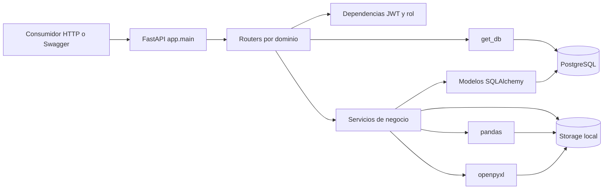
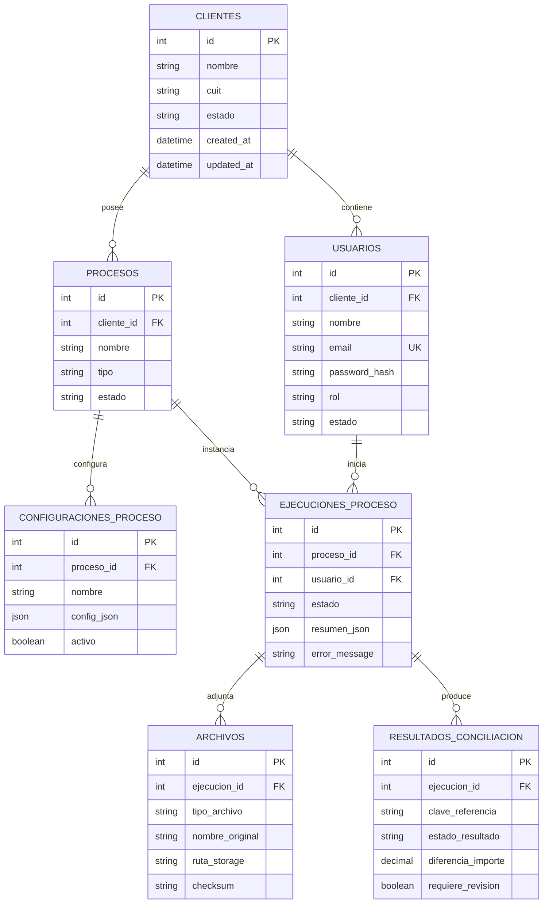
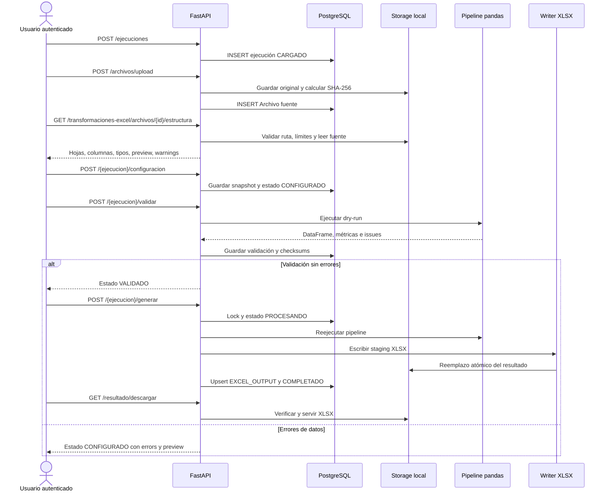

# Reporte técnico de `automatizador-admin`

**Fecha de auditoría:** 2026-08-04  
**Alcance:** estado del working tree, incluidos cambios locales aún no confirmados  
**Fuente principal de verdad:** código actual; la documentación y el roadmap se usan como contexto y se contrastan expresamente

> **Criterio de lectura.** “Implementado” significa que existe un camino de código utilizable. No implica por sí solo que esté desplegado, que tenga cobertura integral o que sea seguro para producción. “Parcial” identifica una capacidad real con ausencias relevantes. “Planeado” se reserva para lo respaldado por el roadmap. Cuando una aspiración solo apareció en el encargo de auditoría se marca como **no verificada en el repositorio**.

## Índice

1. [Resumen ejecutivo](#1-resumen-ejecutivo)
2. [Estado actual comprobado](#2-estado-actual-comprobado)
3. [Stack tecnológico](#3-stack-tecnológico)
4. [Arquitectura general](#4-arquitectura-general)
5. [Estructura del repositorio](#5-estructura-del-repositorio)
6. [Modelo de datos](#6-modelo-de-datos)
7. [API y endpoints](#7-api-y-endpoints)
8. [Autenticación y autorización](#8-autenticación-y-autorización)
9. [Flujo de transformación de Excel](#9-flujo-de-transformación-de-excel)
10. [Configuración y variables de entorno](#10-configuración-y-variables-de-entorno)
11. [Migraciones y base de datos](#11-migraciones-y-base-de-datos)
12. [Tests y calidad](#12-tests-y-calidad)
13. [Manejo de errores, validaciones y observabilidad](#13-manejo-de-errores-validaciones-y-observabilidad)
14. [Seguridad](#14-seguridad)
15. [Deuda técnica y riesgos](#15-deuda-técnica-y-riesgos)
16. [Procedimiento de ejecución local](#16-procedimiento-de-ejecución-local)
17. [Estado de Git y evolución reciente](#17-estado-de-git-y-evolución-reciente)
18. [Recomendaciones técnicas priorizadas](#18-recomendaciones-técnicas-priorizadas)
19. [Guía de incorporación para el tutor](#19-guía-de-incorporación-para-el-tutor)
20. [Preguntas técnicas para discutir con el tutor](#20-preguntas-técnicas-para-discutir-con-el-tutor)
21. [Información no verificada](#21-información-no-verificada)

## 1. Resumen ejecutivo

`automatizador-admin` es hoy un backend monolítico en FastAPI para modelar clientes, procesos administrativos, ejecuciones y archivos. Implementa dos automatizaciones concretas:

- **Conciliación Excel/CSV:** compara dos archivos por clave e importe, clasifica diferencias, permite revisión manual, aprobación o rechazo y exporta un XLSX (`backend/app/api/routes/conciliaciones.py`, `backend/app/services/conciliacion_service.py`).
- **Transformación Excel/CSV:** inspecciona una fuente, guarda una configuración declarativa, ejecuta un dry-run, aplica cinco operaciones controladas, genera un XLSX, permite reutilizar plantillas y expone resumen y trazabilidad (`backend/app/api/routes/transformaciones_excel.py`, `backend/app/services/transformacion_excel_*.py`).

El núcleo más maduro es Transformación Excel. Su pipeline, escritor XLSX, plantillas, controles de integridad y resumen operativo tienen pruebas automatizadas. La auditoría ejecutó 127 tests con resultado `OK (skipped=2)`. Sin embargo, los nueve métodos de integración con PostgreSQL no se ejecutaron porque no había `TEST_DATABASE_URL`, y el entorno virtual local no contiene todavía `httpx`, dependencia añadida al `requirements.txt` modificado.

El proyecto **no tiene frontend**, empaquetado de despliegue, CI, estrategia de observabilidad ni historial reproducible de migraciones. Alembic está configurado, pero no existe ninguna revisión `.py`; la base local coincide hoy con los modelos, aunque `alembic_version` está vacía. Una base nueva solo se puede construir de forma comprobable mediante `Base.metadata.create_all()` y no existe un procedimiento seguro para evolucionar una base existente.

Los riesgos más importantes son:

1. **Aislamiento multicliente roto en gran parte de la API.** Clientes, procesos, ejecuciones, archivos y conciliaciones no filtran por `current_user.cliente_id`; un usuario autenticado puede leer u operar recursos de otro cliente. Transformación Excel sí incorpora verificaciones de tenant en sus servicios.
2. **Firma JWT predecible en la configuración local auditada.** `Settings.secret_key` tiene un valor por defecto conocido, no hay validación de arranque y el `.env` local no lo sobreescribe. Un servicio accesible levantado así permite falsificar tokens si se conoce o adivina un `sub` válido.
3. **Endurecimiento de archivos desigual.** Transformación Excel limita tamaño, dimensiones, ZIP y rutas. El upload copia por stream pero no limita bytes; el preview genérico y conciliación eluden esos controles y cargan archivos completos en DataFrames.
4. **Integridad de flujo insuficiente.** Conciliación no valida tipo de proceso ni estado; puede ejecutarse sobre una ejecución de transformación, rehacerse después de revisión y borrar resultados. En Transformación, configuración/validación no bloquean el estado `PROCESANDO`, lo que abre una carrera con la generación.
5. **Estado no consolidado en Git y documentación contradictoria.** El hardening, tests integrales y documentación que el roadmap marca como “Tarea 22 completada” siguen sin commit. `PROJECT_HANDOFF.md` conserva secciones antiguas que niegan funciones que luego declara implementadas.

Conclusión: existe un prototipo backend funcional y técnicamente interesante, con un motor de transformación considerablemente más sólido que el resto del sistema. Antes de sumar frontend o nuevos tipos de automatización, conviene cerrar seguridad multicliente, secretos, máquina de estados, migraciones y cobertura integral de los dominios administrativos y de conciliación.

## 2. Estado actual comprobado

| Área | Estado | Evidencia | Observaciones |
| --- | --- | --- | --- |
| Backend | Implementado | `backend/app/main.py`; routers en `backend/app/api/routes/` | 46 rutas de aplicación y 4 rutas automáticas de FastAPI registradas. Arranque y `GET /health` verificados localmente. |
| Base de datos | Parcial | `backend/app/models/`; `backend/app/database/session.py` | Siete tablas de dominio. La base PostgreSQL local coincidió con `Base.metadata` al ejecutar `alembic check`, pero no hay cadena de revisiones que la reproduzca. |
| Migraciones | Parcial | `backend/alembic.ini`; `backend/alembic/env.py`; `backend/alembic/versions/.gitkeep` | Alembic está configurado. `heads`, `history` y `current` no informan revisiones; `alembic_version` existe y está vacía. |
| Autenticación | Parcial | `backend/app/api/routes/auth.py`; `backend/app/core/security.py` | Login JSON y OAuth2 form, JWT con expiración y usuario activo. El secreto por defecto está activo localmente; no hay refresh, revocación ni rate limiting. |
| Autorización | Parcial | `backend/app/api/routes/auth.py::require_admin`; servicios `backend/app/services/transformacion_excel_*` | Solo existe la distinción textual `ADMIN`/no admin. El tenant se controla en Transformación Excel, pero no transversalmente. |
| Usuarios | Parcial | `backend/app/models/usuario.py`; `backend/app/api/routes/auth.py::read_current_user`; `backend/scripts/seed_initial_data.py` | Hay modelo, seed y `/auth/me`; no hay CRUD, alta, cambio/restablecimiento de contraseña ni administración de roles. |
| Clientes | Parcial | `backend/app/api/routes/clientes.py` | CRUD lógico implementado; no hay aislamiento por cliente, validación de CUIT ni filtros de activos. |
| Procesos | Parcial | `backend/app/api/routes/procesos.py`; `backend/app/models/proceso.py` | CRUD implementado. `tipo` y `estado` son strings libres; la API permite tipos fuera de los dos documentados. |
| Ejecuciones | Parcial | `backend/app/api/routes/ejecuciones.py`; `backend/app/models/ejecucion_proceso.py` | Crear, listar, leer, editar y cancelar. No hay máquina de estados central; un admin puede sobrescribir estado y JSON arbitrariamente. |
| Configuraciones | Parcial | `ConfiguracionProceso`; `EjecucionProceso.resumen_json`; servicios de mapping y plantillas | No existe API general. El mapping y snapshot de transformación viven por ejecución; `ConfiguracionProceso` se usa realmente para plantillas. La config seed de conciliación no es consumida por el motor. |
| Archivos | Parcial | `backend/app/api/routes/archivos.py`; `backend/app/services/file_service.py`; `backend/app/services/file_preview_service.py` | Upload y preview CSV/XLS/XLSX; se acepta PDF solo para almacenamiento. Sin límite de upload ni descarga genérica; storage local sin retención. |
| Conciliación | Parcial | rutas y servicios `conciliacion_*` | Flujo funcional completo en código, pero sin tests, tenant, validación de tipo/estado, paginación ni trazabilidad uniforme. |
| Transformación Excel | Implementado | schemas y servicios `transformacion_excel_*`; tests | Inspección, configuración, dry-run, pipeline, plantillas, generación, descarga, resumen y trazas. Persistencia acoplada a `resumen_json`; hay defectos de concurrencia y headers duplicados. |
| Generación XLSX | Implementado | `backend/app/services/transformacion_excel_xlsx_writer.py`; `backend/app/services/conciliacion_export_service.py` | Writer de transformación atómico y probado. Export de conciliación no es atómico ni neutraliza fórmulas. |
| Tests | Parcial | `backend/tests/` | Buena cobertura de Transformación Excel; ninguna prueba para CRUD general, auth en aislamiento, conciliación o migraciones. Integración PostgreSQL omitida. |
| Frontend | No implementado | Inventario completo; ausencia de `package.json` y código web | Swagger/ReDoc son la única interfaz interactiva actual. El roadmap lo declara próximo bloque. |
| Despliegue | No implementado | Ausencia de Docker, CI, manifests y configuración de servidor | No hay procedimiento de producción, TLS, backups, workers ni almacenamiento compartido. |
| Observabilidad | Parcial | `/health`; trazas dentro de `resumen_json` para transformación | Sin logging de aplicación, métricas, correlación, readiness de DB/storage o integración externa. |
| Documentación | Parcial | `docs/PROJECT_HANDOFF.md`; `docs/PROJECT_ROADMAP.md`; `backend/docs/TRANSFORMACION_EXCEL.md` | La documentación de transformación es útil, pero el handoff se contradice y no hay README general. |
| PDF | No implementado | `backend/app/services/file_service.py::ALLOWED_EXTENSIONS` acepta `.pdf`; roadmap lo excluye del MVP | Solo se almacena. No hay lectura, validación de contenido, OCR ni pipeline PDF. Su futuro no está comprometido en el roadmap. |
| Inteligencia artificial | No implementado | Sin módulos, dependencias ni roadmap asociado | Aspiración mencionada en el encargo, no verificada en el repositorio. |

## 3. Stack tecnológico

### 3.1 Declaración del repositorio

| Categoría | Tecnología | Declaración verificable | Precisión de versión |
| --- | --- | --- | --- |
| Lenguaje | Python | Código `.py`, scripts y entorno `.venv` local | No hay versión de Python declarada. El intérprete local usado en la auditoría fue 3.12.10; es dato ambiental, no requisito del proyecto. |
| API | FastAPI + Uvicorn | `backend/requirements.txt`; `backend/app/main.py` | Sin pin de versión. |
| Validación/config | Pydantic v2 + `pydantic-settings` | `ConfigDict`, `field_validator`, `model_validator`, `SettingsConfigDict` | Sin pin. El código requiere APIs de Pydantic v2. |
| ORM | SQLAlchemy | `SQLAlchemy>=2.0` | Única cota mínima funcional relevante. |
| Base de datos | PostgreSQL vía psycopg2 | URL `postgresql+psycopg2` en config y `.env.example` | Versión de PostgreSQL no declarada. |
| Migraciones | Alembic | `backend/alembic.ini`, `backend/alembic/env.py` | Sin pin; sin revisiones. |
| Autenticación | `python-jose`, Passlib, bcrypt | JWT y `CryptContext` en `backend/app/core/security.py` | `bcrypt<4.1`; el resto sin pin. |
| Multipart | `python-multipart` | Upload y OAuth2 form | Sin pin. |
| Datos/Excel | pandas, openpyxl, xlrd | Lectura CSV/XLS/XLSX y escritura XLSX | Sin pin. |
| Entorno | `python-dotenv` | Declarado; Pydantic Settings carga `.env` | Sin pin. |
| Tests HTTP | httpx | Añadido al `requirements.txt` modificado; TestClient integral | Sin pin y ausente en la `.venv` auditada. |
| Testing | `unittest` estándar | `backend/tests/` | Sin dependencia externa de runner. |

### 3.2 Entorno local observado

La `.venv` auditada tenía, entre otras, FastAPI 0.136.3, Pydantic 2.13.4, SQLAlchemy 2.0.50, Alembic 1.18.4, pandas 3.0.3, openpyxl 3.1.5, psycopg2-binary 2.9.12 y Uvicorn 0.48.0. Estas versiones se obtuvieron con `pip list`; **no están fijadas por el repositorio** y una instalación nueva puede resolver otras. `pip check` informó que las dependencias instaladas no estaban rotas, pero esto no sustituye un lockfile ni una auditoría de CVE.

Dependencias externas operativas:

- PostgreSQL accesible por `DATABASE_URL`.
- Filesystem local en `backend/storage/` para originales y procesados.
- No se encontraron APIs externas, colas, servicios cloud, correo, OCR ni proveedores de IA.

Herramientas ausentes: `pyproject.toml`, lockfile, configuración de formatter/linter/type checker, `Dockerfile`, Compose, CI, Makefile y README general.

## 4. Arquitectura general

### 4.1 Estilo y capas

El sistema es un **monolito backend sincrónico** organizado por capas simples:

- `app/api/routes/`: transporte HTTP, dependencias de auth/DB y traducción de algunas excepciones.
- `app/schemas/`: contratos Pydantic.
- `app/services/`: lógica de archivos, conciliación y transformación.
- `app/models/`: entidades ORM.
- `app/database/`: engine, sesión y base declarativa.
- `app/core/`: settings y primitivas criptográficas.

No existe una capa repository separada. Los CRUD básicos consultan SQLAlchemy directamente desde los routers; los módulos de negocio usan servicios. Esto produce dos estándares de diseño: Transformación Excel encapsula tenant, errores e integridad en servicios, mientras clientes/procesos/ejecuciones/archivos y conciliación dejan controles importantes en rutas o no los implementan.



Todos los nodos representan componentes existentes. No se incluye frontend, worker ni cola porque no existen.

### 4.2 Flujo típico de una solicitud

1. Uvicorn entrega la solicitud a `backend/app/main.py::app`.
2. El router valida path/query/body con FastAPI y Pydantic.
3. Las rutas protegidas llaman `backend/app/api/routes/auth.py::get_current_user`; las administrativas añaden `require_admin`.
4. `get_db` abre una sesión SQLAlchemy por solicitud.
5. El router consulta directamente los modelos o delega a un servicio.
6. El servicio puede leer/escribir PostgreSQL, pandas y `backend/storage/`.
7. Pydantic serializa la respuesta o `FileResponse` transmite un archivo.

### 4.3 Acoplamientos y límites

- `EjecucionProceso.resumen_json` funciona simultáneamente como mapping de conciliación, snapshot/config/validación/generación/trazas de transformación y rechazo. Es flexible, pero dificulta versionado, consultas, concurrencia y separación de dominios.
- Los estados de conciliación y transformación comparten `EjecucionProceso.estado` sin una máquina que relacione estado con tipo de proceso.
- `Archivo` mezcla originales y resultados mediante `tipo_archivo` libre.
- La persistencia en DB y filesystem no participa de una transacción distribuida; el módulo de transformación implementa compensaciones cuidadosas, mientras upload y export de conciliación no.
- Servicios sincrónicos cargan DataFrames completos y generan archivos durante la solicitud HTTP.

## 5. Estructura del repositorio

| Ruta | Responsabilidad real | Observaciones |
| --- | --- | --- |
| `backend/app/main.py` | Construye FastAPI e incluye ocho routers | No registra middleware, handlers globales ni eventos de startup. |
| `backend/app/api/routes/` | Health, auth, clientes, procesos, ejecuciones, archivos, conciliación y transformación | 46 rutas de aplicación. |
| `backend/app/core/config.py` | Settings desde entorno y defaults | No valida secreto seguro ni algoritmo/expiración. |
| `backend/app/core/security.py` | Hash/verify bcrypt y encode/decode JWT | Primitivas, no política de contraseñas o sesiones. |
| `backend/app/database/` | `Base`, engine, `SessionLocal`, `get_db` | Engine global síncrono con `pool_pre_ping=True`. |
| `backend/app/models/` | Siete modelos SQLAlchemy | Estados/tipos son strings; escasas restricciones de negocio. |
| `backend/app/schemas/` | Entradas/salidas Pydantic | Transformación tiene contratos fuertes; CRUD básico es permisivo. |
| `backend/app/services/conciliacion_*` | Mapping, ejecución, revisión y exportación | Sin tenant, tipo/estado o cobertura automática. |
| `backend/app/services/transformacion_excel_*` | Inspección, config, pipeline, validación, generación, plantillas, seguridad, resumen y trazas | Módulo más cohesivo; varios cambios siguen sin seguimiento o commit. |
| `backend/app/services/file_service.py` | Guarda uploads y calcula checksum | Acepta CSV/XLS/XLSX/PDF; sin límite durante copia. |
| `backend/app/services/file_preview_service.py` | Preview genérico | Implementación heredada sin resolución segura ni límites. |
| `backend/alembic/` | Configuración y plantilla Alembic | `versions/` no contiene revisiones fuente. Hay bytecode local huérfano que no constituye una migración verificable. |
| `backend/scripts/create_tables.py` | Crea tablas faltantes con `create_all` | Útil para bootstrap, no para evolucionar columnas/constraints. |
| `backend/scripts/seed_initial_data.py` | Seed idempotente de demo | Incluye credencial inicial fija y una config de conciliación no consumida. |
| `backend/tests/` | Tests del módulo Transformación Excel | Unitarios y una suite integral condicionada a PostgreSQL de test. |
| `backend/docs/TRANSFORMACION_EXCEL.md` | Referencia operativa del módulo | Es el documento técnico más actualizado del flujo Excel. |
| `docs/PROJECT_HANDOFF.md` | Handoff histórico y actualizaciones | Internamente contradictorio. |
| `docs/PROJECT_ROADMAP.md` | Visión/alcance funcional | Declara frontend como próximo bloque; sobrestima algunos hitos. |
| `backend/storage/` | Originales y procesados locales ignorados por Git | Contiene artefactos de desarrollo; sin política de retención o backup. |
| Archivos `ventas_origen*` y `test_archivo_a.csv` | Datos de muestra | Algunos están versionados; no existe catálogo ni guía formal de uso. |
| `.gitignore` | Ignora envs, storage, bytecode, tooling y builds web | Dos `.pyc` ya estaban versionados y seguirán trackeados aunque el patrón los ignore. |

No se encontró `README.md` en ninguna ubicación. La búsqueda textual no halló marcadores `TODO`/`FIXME` relevantes ni stubs evidentes en código propio. Eso no prueba ausencia de código muerto: no se ejecutó un analizador estático de uso. Los candidatos concretos a revisar son la configuración seed de conciliación no consumida, los datos de muestra sin guía y los `.pyc` versionados/huérfanos ya indicados.

## 6. Modelo de datos

### 6.1 Entidades y restricciones

| Tabla / modelo | Columnas principales y restricciones | Relaciones | Observaciones |
| --- | --- | --- | --- |
| `clientes` / `Cliente` | `id` PK autoincrement; `nombre` varchar(150) no nulo; `cuit` varchar(20) nullable; `estado` varchar(30) default `ACTIVO`; `created_at`; `updated_at` | 1:N usuarios, 1:N procesos | Sin unique de CUIT/nombre, enum/check de estado ni borrado en cascada. |
| `usuarios` / `Usuario` | `id`; `cliente_id` FK no nula; `nombre`; `email` unique/index; `password_hash`; `rol`; `estado`; timestamps | N:1 cliente, 1:N ejecuciones | Email es string, no `EmailStr`; rol/estado libres; no auditoría de login o password. |
| `procesos` / `Proceso` | `id`; `cliente_id` FK; `nombre`; `tipo`; `descripcion`; `estado`; timestamps | N:1 cliente, 1:N configuraciones, 1:N ejecuciones | Sin restricción a `CONCILIACION_EXCEL`/`TRANSFORMACION_EXCEL`; nombres duplicables. |
| `configuraciones_proceso` / `ConfiguracionProceso` | `id`; `proceso_id` FK; `nombre`; `config_json` JSON; `activo`; timestamps | N:1 proceso | Almacén heterogéneo. Plantillas se distinguen por `modulo` y `schema_version` dentro del JSON; unique de nombre solo se controla en código y puede sufrir carreras. |
| `ejecuciones_proceso` / `EjecucionProceso` | `id`; `proceso_id` FK; `usuario_id` FK; `estado` default `CARGADO`; `resumen_json`; `error_message`; `started_at`; `finished_at`; `created_at` | N:1 proceso/usuario, 1:N archivos/resultados | `started_at` nace al crear la ejecución, no al procesar. Sin `updated_at`, versión optimista o constraint de estado. |
| `archivos` / `Archivo` | `id`; `ejecucion_id` FK; `tipo_archivo`; `nombre_original`; `ruta_storage`; extensión, MIME, tamaño, checksum; `uploaded_at` | N:1 ejecución | Tipo/MIME libres. La ruta es dato persistido y aparece en `ArchivoRead`. |
| `resultados_conciliacion` / `ResultadoConciliacion` | `id`; `ejecucion_id` FK; clave; estado; dos JSON de fila; diferencia numeric(15,2); flag revisión; observación; timestamps | N:1 ejecución | Sin unique de resultado/clave, actor de revisión ni historial de cambios. |

Las FK no declaran `ondelete`; las relaciones ORM no configuran cascadas. Excepto el índice/unique de `usuarios.email`, no hay índices explícitos para FK o filtros frecuentes.

### 6.2 Estados y valores observados

- Cliente/usuario/proceso: `ACTIVO`, `INACTIVO` según defaults y rutas, sin enum.
- Roles: `ADMIN` en seed y `OPERADOR` en tests integrales; cualquier string cabe en DB.
- Ejecución de conciliación: `CARGADO`, `PROCESANDO`, `REQUIERE_REVISION`, `APROBADO`, `RECHAZADO`, `ERROR`, `CANCELADO`.
- Ejecución de transformación: `CARGADO`, `CONFIGURADO`, `VALIDADO`, `PROCESANDO`, `COMPLETADO`, `ERROR`, más estados terminales compartidos.
- Resultado de conciliación: `CONCILIADO`, `DIFERENCIA_IMPORTE`, `SOLO_ARCHIVO_A`, `SOLO_ARCHIVO_B`, `DUPLICADO_ARCHIVO_A`, `DUPLICADO_ARCHIVO_B`, `ERROR_FORMATO`.
- Archivo de salida de transformación: `tipo_archivo="EXCEL_OUTPUT"`; otros tipos llegan como texto del formulario.

Nada impide por DB o por el PATCH administrativo introducir estados/tipos distintos.

### 6.3 Diagrama entidad-relación actual



### 6.4 Modelos, base local y migraciones

- `Base.metadata` registró las siete tablas anteriores.
- La base local tenía esas siete tablas más `alembic_version`.
- `alembic check` respondió `No new upgrade operations detected`, por lo que el esquema local observado coincide con la metadata actual según el comparador de Alembic.
- No se puede comparar el modelo con una historia de migraciones: no existen revisiones fuente y `alembic_version` no contiene versión.
- Los `.pyc` locales con nombres de revisiones no son revisiones fuente versionadas, portables ni evidencia autoritativa/reproducible para afirmar qué migraciones existieron.

## 7. API y endpoints

### 7.1 Convenciones comunes

Se verificaron 50 objetos de ruta: 46 de aplicación y cuatro automáticos (`/openapi.json`, `/docs`, `/docs/oauth2-redirect`, `/redoc`). Cada ruta de aplicación declara un método; las cuatro automáticas admiten `GET` y `HEAD`, por lo que la introspección devuelve 54 pares método/ruta. Las tablas muestran su uso interactivo por `GET`. En ellas, `JWT` significa `get_current_user`; `ADMIN` agrega `require_admin`.

Errores transversales:

- Body/query inválido: FastAPI/Pydantic responde 422.
- Ruta protegida sin bearer o con JWT inválido/expirado: 401.
- Usuario existente pero inactivo: 403.
- Ruta ADMIN con rol distinto de la cadena exacta `ADMIN`: 403.
- Los routers no documentan respuestas de error en OpenAPI y las descargas aparecen sin un `response_class`/content type declarativo preciso.

### 7.2 Infraestructura y autenticación

| Método y ruta | Objetivo; parámetros/entrada | Salida | Auth | Validaciones y errores específicos | Procesador / estado |
| --- | --- | --- | --- | --- | --- |
| `GET /health` | Liveness sin parámetros | `{"status":"ok"}` | Pública | No comprueba DB ni storage | `backend/app/api/routes/health.py::health_check`; implementado |
| `GET /openapi.json` | Esquema generado | OpenAPI JSON | Pública | Puede reflejar descargas como JSON | FastAPI; implementado |
| `GET /docs` | Swagger UI | HTML | Pública | Sin restricción por entorno | FastAPI; implementado |
| `GET /docs/oauth2-redirect` | Callback Swagger OAuth2 | HTML | Pública | Automático | FastAPI; implementado |
| `GET /redoc` | ReDoc | HTML | Pública | Automático | FastAPI; implementado |
| `POST /auth/login` | Body `LoginRequest(email,password)` | `TokenResponse` + `UsuarioRead` | Pública | 401 credenciales; 403 inactivo | `backend/app/api/routes/auth.py::authenticate_user/build_token_response`; implementado |
| `POST /auth/token` | Form OAuth2 `username,password` | `TokenResponse` | Pública | 401 credenciales; 403 inactivo | Mismo servicio inline; implementado para Swagger |
| `GET /auth/me` | Usuario del bearer | `UsuarioRead` | JWT | 401/403 comunes | `backend/app/api/routes/auth.py::read_current_user`; implementado |

### 7.3 Clientes, procesos y ejecuciones

| Método y ruta | Objetivo; parámetros/entrada | Salida | Auth | Validaciones y errores específicos | Procesador / estado |
| --- | --- | --- | --- | --- | --- |
| `GET /clientes` | Listar todos | `list[ClienteRead]` | JWT | Sin filtro tenant/estado/paginación | Consulta directa en `backend/app/api/routes/clientes.py`; parcial |
| `POST /clientes` | Crear; `ClienteCreate` | `ClienteRead`, 201 | ADMIN | Solo tipos Pydantic; errores de longitud/integridad no controlados | `backend/app/api/routes/clientes.py::create_cliente`; parcial |
| `GET /clientes/{cliente_id}` | Leer por ID | `ClienteRead` | JWT | 404; sin tenant | `get_cliente_or_404`; parcial |
| `PATCH /clientes/{cliente_id}` | Campos opcionales `ClienteUpdate` | `ClienteRead` | ADMIN | 404; permite `null` en campos que DB no admite y estados libres | `update_cliente`; parcial |
| `DELETE /clientes/{cliente_id}` | Soft delete | `ClienteRead` | ADMIN | 404; fija `INACTIVO` | `delete_cliente`; implementado con alcance parcial |
| `GET /procesos` | Query opcional `cliente_id` | `list[ProcesoRead]` | JWT | Sin tenant/estado/paginación | Consulta directa en `backend/app/api/routes/procesos.py`; parcial |
| `POST /procesos` | `ProcesoCreate` | `ProcesoRead`, 201 | ADMIN | 400 cliente inexistente; tipo/estado libres | `ensure_cliente_exists/create_proceso`; parcial |
| `GET /procesos/{proceso_id}` | Leer | `ProcesoRead` | JWT | 404; sin tenant | `get_proceso_or_404`; parcial |
| `PATCH /procesos/{proceso_id}` | `ProcesoUpdate` | `ProcesoRead` | ADMIN | 400 cliente inexistente; 404; acepta null/strings arbitrarios | `update_proceso`; parcial |
| `DELETE /procesos/{proceso_id}` | Soft delete | `ProcesoRead` | ADMIN | 404; fija `INACTIVO` | `delete_proceso`; parcial |
| `GET /ejecuciones` | Query `proceso_id`, `estado` | `list[EjecucionProcesoRead]` | JWT | Sin tenant/paginación | Consulta directa en `backend/app/api/routes/ejecuciones.py`; parcial |
| `POST /ejecuciones` | `EjecucionProcesoCreate(proceso_id)` | `EjecucionProcesoRead`, 201 | JWT | 400 proceso inexistente; permite proceso de otro tenant/inactivo | `ensure_proceso_exists/create_ejecucion`; parcial |
| `GET /ejecuciones/{ejecucion_id}` | Leer | `EjecucionProcesoRead` | JWT | 404; sin tenant | `get_ejecucion_or_404`; parcial |
| `PATCH /ejecuciones/{ejecucion_id}` | `EjecucionProcesoUpdate` | `EjecucionProcesoRead` | ADMIN | 404; permite sobrescribir estado, resumen, error y fin sin transición | `update_ejecucion`; parcial/riesgoso |
| `DELETE /ejecuciones/{ejecucion_id}` | Cancelación lógica | `EjecucionProcesoRead` | ADMIN | 404; fija `CANCELADO` sin validar estado | `delete_ejecucion`; parcial |

### 7.4 Archivos

| Método y ruta | Objetivo; parámetros/entrada | Salida | Auth | Validaciones y errores específicos | Procesador / estado |
| --- | --- | --- | --- | --- | --- |
| `POST /archivos/upload` | Multipart: `ejecucion_id`, `tipo_archivo`, `file` | `ArchivoRead`, 201 | JWT | 404 ejecución; 400 extensión. Sin tenant, tamaño, MIME/firma, estado o cleanup ante fallo DB | `backend/app/services/file_service.py::save_upload_file`; parcial |
| `GET /archivos/ejecucion/{ejecucion_id}` | Listar adjuntos | `list[ArchivoRead]` | JWT | 404 ejecución; sin tenant/paginación; expone `ruta_storage` | Consulta en `backend/app/api/routes/archivos.py`; parcial |
| `GET /archivos/{archivo_id}/preview` | Query `limit` 1..100 | `ArchivoPreviewRead` | JWT | 404 registro/físico; 400 formato/lectura; sin tenant ni límites reales de lectura | `backend/app/services/file_preview_service.py::build_file_preview`; parcial |

### 7.5 Conciliaciones

| Método y ruta | Objetivo; parámetros/entrada | Salida | Auth | Validaciones y errores específicos | Procesador / estado |
| --- | --- | --- | --- | --- | --- |
| `PATCH /conciliaciones/resultados/{resultado_id}/revision` | `ResultadoRevisionUpdate` | `ResultadoConciliacionRead` | JWT | 404 resultado; no valida tenant/estado/actor | `update_resultado_revision`; parcial |
| `POST /conciliaciones/{ejecucion_id}/mapping` | `ConciliacionMappingCreate` | `ConciliacionMappingRead` | JWT | 404 recursos; 400 mismo archivo, pertenencia, columnas/preview | `save_conciliacion_mapping`; parcial |
| `GET /conciliaciones/{ejecucion_id}/mapping` | Leer mapping | `ConciliacionMappingRead` | JWT | 404 ejecución/mapping | `get_conciliacion_mapping`; parcial |
| `POST /conciliaciones/{ejecucion_id}/ejecutar` | Ejecutar mapping guardado | `ConciliacionResumenRead` | JWT | 400/404 funcional; 500 genérico inesperado. No valida tenant, tipo ni estado | `execute_reconciliation`; parcial |
| `GET /conciliaciones/{ejecucion_id}/resultados` | Query opcional `estado_resultado` | `list[ResultadoConciliacionRead]` | JWT | 404 ejecución; filtro string libre, sin paginación/tenant | `list_reconciliation_results`; parcial |
| `GET /conciliaciones/{ejecucion_id}/exportar` | Crear/servir XLSX | `FileResponse` | JWT | 400 sin resultados; 404 ejecución; sin tipo/estado/tenant | `export_reconciliation_results`; parcial |
| `GET /conciliaciones/{ejecucion_id}/revision-resumen` | Métricas de revisión | `RevisionResumenRead` | JWT | 404 ejecución | `get_revision_summary`; parcial |
| `POST /conciliaciones/{ejecucion_id}/aprobar` | Aprobar sin pendientes | `RevisionResumenRead` | ADMIN | 400 sin resultados/pendientes; 404; sin tenant/tipo/transición | `approve_execution`; parcial |
| `POST /conciliaciones/{ejecucion_id}/rechazar` | Body opcional `RechazarEjecucionRequest` | `RevisionResumenRead` | ADMIN | 404; motivo opcional; sin tenant/tipo/transición | `reject_execution`; parcial |

### 7.6 Transformaciones Excel

| Método y ruta | Objetivo; parámetros/entrada | Salida | Auth | Validaciones y errores específicos | Procesador / estado |
| --- | --- | --- | --- | --- | --- |
| `GET /transformaciones-excel/archivos/{archivo_id}/estructura` | Query `sheet_name`, `header_row>=1`, `limit` 1..100 | `TransformacionExcelStructureRead` | JWT | 400 formato/hoja/header; 403 tenant; 404; 413 límites | `build_transformacion_excel_structure`; implementado |
| `GET /transformaciones-excel/procesos/{proceso_id}/plantillas` | Query `incluir_inactivas` | `TransformacionExcelTemplateListRead` | JWT | 400 tipo/config; 403 tenant; 404. Usuario normal puede solicitar inactivas | `list_process_templates`; implementado con inconsistencia menor |
| `GET /transformaciones-excel/plantillas/{plantilla_id}` | Leer plantilla | `TransformacionExcelTemplateRead` | JWT | 400 inactiva/config; 403 tenant; 404. Admin puede leer inactiva | `read_template`; implementado |
| `PUT /transformaciones-excel/plantillas/{plantilla_id}` | `TransformacionExcelTemplateUpdate` | `TransformacionExcelTemplateRead` | ADMIN | 400 payload/config; 403 tenant; 404; 409 nombre duplicado | `update_template`; implementado |
| `DELETE /transformaciones-excel/plantillas/{plantilla_id}` | Desactivar | 204 | ADMIN | 400/403/404 | `deactivate_template`; implementado |
| `POST /transformaciones-excel/{ejecucion_id}/plantillas` | Crear desde config guardada; `TransformacionExcelTemplateCreate` | `TransformacionExcelTemplateRead`, 201 | ADMIN | 400 estado/config; 403 tenant; 404; 409 nombre | `create_template_from_execution`; implementado |
| `POST /transformaciones-excel/{ejecucion_id}/plantillas/{plantilla_id}/aplicar` | `TransformacionExcelTemplateApply(archivo_id, overrides)` | `TransformacionExcelConfigRead` | JWT | 400 estado/proceso/columnas; 403 tenant; 404 | `apply_template_to_execution`; implementado |
| `GET /transformaciones-excel/{ejecucion_id}/resumen` | Estado/capacidades/issues | `TransformacionExcelOperationalSummaryRead` | JWT | 400 tipo/resumen; 403 tenant; 404 | `get_transformacion_operational_summary`; implementado |
| `GET /transformaciones-excel/{ejecucion_id}/trazabilidad` | Query `limit` 1..200 | `TransformacionExcelTraceListRead` | JWT | 400 tipo; 403 tenant; 404 | `get_transformacion_trace_list`; implementado |
| `POST /transformaciones-excel/{ejecucion_id}/configuracion` | `TransformacionExcelConfig` | `TransformacionExcelConfigRead` | JWT | 400 fuente/columnas/estado; 403 tenant; 404; 413 archivo. Acepta `PROCESANDO` por defecto de implementación | `save_transformacion_config`; implementado con defecto de concurrencia |
| `GET /transformaciones-excel/{ejecucion_id}/configuracion` | Leer snapshot | `TransformacionExcelConfigRead` | JWT | 400 tipo; 403 tenant; 404 ejecución/config; un JSON persistido inválido puede escapar como 500 | `get_saved_transformacion_config`; implementado |
| `POST /transformaciones-excel/{ejecucion_id}/validar` | Query `preview_limit` 1..100 | `TransformacionExcelValidationRead` | JWT | 400 config/datos; 403; 404; 409 fuente cambiante; 413 límites; 500 técnico | `validate_transformacion_execution`; implementado con defecto de concurrencia |
| `POST /transformaciones-excel/{ejecucion_id}/generar` | Generar o reutilizar salida | `TransformacionExcelGenerationRead` | JWT | 400 output/config; 403; 404; 409 estado/integridad; 413 fuente; 500 técnico | `generate_transformacion_result`; implementado |
| `GET /transformaciones-excel/{ejecucion_id}/resultado` | Metadata del resultado | `TransformacionExcelGenerationRead` | JWT | 400 tipo; 403 tenant; 404 resultado/físico; 409 procesando | `get_transformacion_result`; implementado |
| `GET /transformaciones-excel/{ejecucion_id}/resultado/descargar` | Descargar XLSX | `FileResponse` con `nosniff`/`no-store` | JWT | 400 tipo; 403 tenant; 404; 409 | `get_transformacion_result_download`; implementado |

## 8. Autenticación y autorización

### 8.1 Flujo de autenticación

1. `/auth/login` recibe JSON o `/auth/token` recibe form OAuth2.
2. `backend/app/api/routes/auth.py::get_user_by_email` busca email exacto.
3. `backend/app/core/security.py::verify_password` usa Passlib con bcrypt.
4. Se rechaza un usuario no encontrado, contraseña incorrecta o `estado != "ACTIVO"`.
5. `create_access_token` firma un JWT con `sub=<id de usuario>` y `exp` UTC; algoritmo y duración vienen de settings.
6. `OAuth2PasswordBearer` extrae el bearer; `decode_access_token` verifica firma/exp y `get_current_user` vuelve a cargar el usuario.

No hay refresh token, revocación, `jti`, audiencia, issuer, sesión persistida, cierre de sesión, MFA, bloqueo por intentos o rotación de contraseña. Además, `get_current_user` convierte `sub` con `int()` pero solo captura `ValueError`: un JWT válidamente firmado cuyo `sub` sea un objeto/lista provoca `TypeError` y 500 en lugar de 401. Con un emisor confiable sería un borde defensivo; con el secreto local conocido es alcanzable por un atacante.

### 8.2 Autorización real

`require_admin` compara literalmente `current_user.rol != "ADMIN"`. No hay scopes ni permisos por acción. “Cliente” es una entidad de datos, no un rol.

La autorización tiene dos comportamientos incompatibles:

- **Transformación Excel:** los endpoints basados en ejecución y plantillas comparan tenant y validan tipo; la inspección de estructura compara tenant y formato, pero no exige tipo `TRANSFORMACION_EXCEL`.
- **Resto de la API:** routers CRUD, archivos y servicios de conciliación solo exigen usuario activo o ADMIN, pero no filtran ni verifican tenant. El objeto `current_user` incluso queda sin usar en varias rutas.

Por ello, la autenticación funciona, pero la autorización multicliente —parte central de la visión del producto— es **parcial y vulnerable**.

### 8.3 Contraseñas y secretos

- Los hashes se almacenan en `Usuario.password_hash`; no se devuelve ese campo.
- El seed llama `get_password_hash`, pero publica una credencial de administrador fija en el código y no fuerza su cambio.
- `SECRET_KEY` posee defaults conocidos tanto en código como en `.env.example`.
- La auditoría comprobó sin mostrar el valor que el entorno local estaba usando el default declarado.
- La aplicación no falla al arrancar con ese secreto, ni exige longitud/entropía.

### 8.4 Riesgos inmediatos

- Falsificación de JWT en una instancia levantada con el default.
- Lectura/modificación entre clientes mediante IDs incrementales.
- Rol ADMIN ambiguo: no está definido si es administrador global o del cliente; hoy se vuelve global en CRUD/conciliación y tenant-local en transformación.
- Credencial seed reutilizable y sin endpoint de cambio.
- Login sin límites de intentos y tokens no revocables hasta expirar.

## 9. Flujo de transformación de Excel

### 9.1 Flujo completo comprobado

El flujo es API-first y requiere construir previamente cliente, proceso y ejecución:

1. **Crear o elegir proceso.** Debe ser `TRANSFORMACION_EXCEL`; el seed crea uno de demo (`backend/scripts/seed_initial_data.py::get_or_create_proceso_transformacion_excel`).
2. **Crear ejecución.** `POST /ejecuciones` la deja en `CARGADO` y asocia el usuario autenticado.
3. **Subir fuente.** `POST /archivos/upload` guarda CSV/XLS/XLSX bajo `backend/storage/originals/{ejecucion_id}/`, crea un nombre con stem + UUID, calcula SHA-256 y registra `Archivo`. El upload también acepta PDF, pero el módulo de transformación lo rechaza.
4. **Inspeccionar.** `GET /transformaciones-excel/archivos/{archivo_id}/estructura` resuelve la ruta dentro de storage, valida tamaño/contenedor, selecciona hoja/header, carga pandas y devuelve columnas, tipos sugeridos, nulos, preview, total y warnings.
5. **Configurar.** `POST /transformaciones-excel/{ejecucion_id}/configuracion` valida el contrato, que el archivo pertenezca a la ejecución y que todas las columnas referidas existan. Guarda un snapshot en `resumen_json["transformacion_excel"]["configuracion"]` y deja `CONFIGURADO`.
6. **Dry-run.** `/validar` vuelve a leer la fuente, ejecuta el mismo pipeline usado por generación, persiste métricas/issues/preview y checksums. Queda `VALIDADO` si no hay errores o regresa a `CONFIGURADO` si los hay.
7. **Generar.** `/generar` exige una validación exitosa vigente. Reserva `VALIDADO -> PROCESANDO` con `SELECT ... FOR UPDATE`, libera el lock, recalcula integridad, ejecuta el pipeline y escribe un XLSX temporal.
8. **Persistir salida.** Reemplaza atómicamente el archivo final, crea o actualiza un único `Archivo` `EXCEL_OUTPUT`, guarda metadata en `resumen_json`, elimina duplicados/obsoletos controlados y marca `COMPLETADO`.
9. **Consultar/descargar.** Los cuatro endpoints validan tipo y tenant. `/resultado` y `/resultado/descargar` además comprueban estado, registro, ruta, existencia, tamaño y checksum; `/resumen` usa registro/ruta/existencia para derivar capacidades sin comprobar tamaño/checksum, y `/trazabilidad` devuelve eventos tras validar la ejecución.



### 9.2 Lectura, estructura y seguridad de la fuente

`backend/app/services/transformacion_excel_inspeccion_service.py` admite:

- CSV con intento secuencial de `utf-8-sig`, `utf-8` y `latin-1`; separador inferido por pandas.
- XLS mediante el engine disponible a través de pandas/xlrd.
- XLSX mediante pandas/openpyxl, con preflight ZIP antes de leer.
- `header_row` basado en 1 y selección de hoja exacta; si no se elige hoja Excel usa la primera.

`backend/app/services/transformacion_excel_security_service.py` controla:

- Ruta canónica dentro de `backend/storage`, incluida salida por symlink cuando el sistema operativo permite resolverlo.
- Tamaño físico máximo.
- En XLSX: entradas ZIP con traversal/absolutas, presencia/parsing de `xl/workbook.xml`, expansión total, ratio de compresión y cantidad de hojas.
- Dimensiones del DataFrame después de leerlo.
- SHA-256 determinista de archivo y configuración.

Límites: la carga completa ocurre antes de comprobar filas/columnas; XLS no tiene preflight ZIP equivalente; no hay antivirus, inspección de relaciones externas o macros, ni streaming/chunks.

### 9.3 Representación y operaciones

La representación interna es un `pandas.DataFrame`; el pipeline hace una copia profunda y agrega una columna interna única para conservar el número de fila de origen. La configuración es `TransformacionExcelConfig`:

| Operación | Entradas | Comportamiento | Error/warning relevante |
| --- | --- | --- | --- |
| `SOURCE` | `source_column` | Copia y convierte a tipo de salida | `INVALID_*`, `REQUIRED_VALUE_MISSING` |
| `CONSTANT` | escalar/null | Repite valor y convierte | Conversión o required |
| `CONCAT` | partes `SOURCE`/`LITERAL` | Convierte fuentes a texto; vacío aporta `""` | Conversión final/required |
| `ARITHMETIC` | dos operandos fuente/constante; `ADD`, `SUBTRACT`, `MULTIPLY`, `DIVIDE` | Opera con `Decimal`, redondeo `ROUND_HALF_UP` | Operando inválido, división por cero, resultado entero inválido |
| `VALUE_MAP` | columna, mapa, política | Match trim + casefold | `ERROR`, o warnings al conservar/default |

Tipos de salida: `text`, `integer`, `decimal`, `date`. El tipo booleano se detecta durante inspección, pero no es tipo de salida. Las fechas de entrada aceptan un conjunto fijo ISO y día/mes/año; `date_format` controla el formato de celda XLSX, no el parser. Los decimales aceptan formas locales/internacionales, rechazan agrupaciones ambiguas y no admiten booleanos como números.

### 9.4 Filas, vacíos y orden de ejecución

Orden exacto en `backend/app/services/transformacion_excel_pipeline.py::run_transformacion_pipeline`:

1. Normalización de índice/número de fila.
2. Hasta cinco filtros combinados con AND: `EQUALS`, `IN`, `NOT_EMPTY`, `IS_EMPTY`, `GREATER_THAN`, `LESS_THAN`, `CONTAINS`.
3. Transformaciones ordenadas por `position`.
4. Conversión y validación `required`.
5. Exclusión de filas con errores.
6. Deduplicación opcional por columnas de salida, `keep=FIRST`.
7. Hasta tres ordenamientos estables; nulos al final en ASC y DESC.
8. Selección del orden final y eliminación de columnas internas.

Se consideran vacíos `None`, `NaN` y strings vacíos o solo espacios. Los errores bloquean que el resultado sea válido; filas filtradas, deduplicadas o valores no mapeados conservados/default generan warnings. Cada issue agrega conteo y hasta diez muestras.

### 9.5 Generación XLSX

`backend/app/services/transformacion_excel_xlsx_writer.py`:

- Valida que el filename termine en `.xlsx`, no contenga separadores y permanezca bajo el directorio permitido.
- Valida hoja no vacía, máximo de 31 caracteres y caracteres prohibidos de Excel.
- Escribe sin índice, conserva orden de columnas, aplica header en negrita, freeze, autofilter, ancho automático y formatos por tipo.
- Neutraliza en **valores textuales** prefijos `=`, `+`, `-`, `@` anteponiendo apóstrofo.
- Escribe primero un `NamedTemporaryFile` y usa `os.replace`.

La generación agrega una segunda capa de staging/backup para coordinar el archivo con el commit del registro `Archivo`. El output se guarda en `backend/storage/processed/{ejecucion_id}/{file_name}`; la ruta persistida es relativa al padre de storage. La API devuelve ID, nombre, MIME, tamaño, checksum, filas, columnas, fecha y `reused`.

Todos los temporales de generación quedan en ese mismo directorio por ejecución. La capa exterior crea `.{UUID}.pending.xlsx` y, si ya había salida, `.{UUID}.backup.xlsx`; el writer crea además un nombre aleatorio con prefijo `.{output_stem}.` y sufijo `.tmp.xlsx`. Los reemplazos usan `os.replace`; los bloques de éxito/error intentan eliminar staging/backup/temporal o restaurar el backup. No hay un directorio temporal global ni un registro DB de esos archivos transitorios.

Defectos confirmados:

- Los **encabezados configurables** no se neutralizan. Una prueba temporal con `output_column="=2+2"` produjo una celda A1 de tipo fórmula.
- Encabezados fuente duplicados solo generan warning. Con dos columnas llamadas igual, `row["A"]` puede producir una Series; una prueba temporal obtuvo `valid=True` y serializó esa Series como texto, es decir, corrupción silenciosa.
- No hay máximo de columnas de salida, partes de concatenación, entradas de mapping o `decimal_places`; valores extremos pueden consumir CPU/memoria.

### 9.6 Estados, integridad y reutilización

Flujo nominal: `CARGADO -> CONFIGURADO -> VALIDADO -> PROCESANDO -> COMPLETADO`. Errores funcionales de validación dejan `CONFIGURADO`; errores técnicos intentan dejar `ERROR`. Cambiar configuración elimina validación/generación e inserta `VALIDATION_INVALIDATED`. Fuente o config con checksum distinto produce 409 y exige repetir el dry-run.

Si una ejecución `COMPLETADO` tiene registros de output y el primero por ID apunta a un archivo válido, `/generar` lo reutiliza y registra `GENERATION_REUSED`. Esa salida temprana no exige que exista un solo registro ni depura duplicados; la limpieza ocurre únicamente durante una generación efectiva. La idempotencia es parcial: el artefacto elegido permanece estable, la primera reutilización agrega una traza y reutilizaciones idénticas consecutivas la deduplican por archivo/checksum. Tampoco vuelve a comparar el checksum actual de la fuente con el de la validación, por lo que una fuente alterada después de completar puede dejar que se entregue el resultado anterior. Un `PROCESANDO` antiguo solo aparece como `STALE_PROCESSING_STATE` en el resumen; no existe recuperación automática.

Hay una carrera importante: `backend/app/services/transformacion_excel_config_service.py::validate_execution_is_editable` solo bloquea estados terminales, no `PROCESANDO`. Por tanto, configuración o validación pueden ejecutarse después de que generación libera su lock y mientras sigue procesando. El resumen dice que no se puede editar, pero el backend lo permite; ambos requests pueden sobrescribir `resumen_json`/estado y la generación puede terminar con una configuración obsoleta. No existe test concurrente.

### 9.7 Plantillas, resumen y trazas

- Plantillas: registros `ConfiguracionProceso` con `modulo="TRANSFORMACION_EXCEL"`, `schema_version=1`; excluyen `archivo_id` y son específicas del proceso/cliente.
- Crear/editar/desactivar requiere ADMIN; aplicar requiere usuario del tenant. El nombre único se controla por consulta Python, no constraint.
- El resumen deriva `action_required`, capacidades, fuente, plantilla, validación, generación e issues.
- `can_download` solo exige estado, registro y existencia física; `/resultado/descargar` además valida ruta, tamaño y checksum. Por ello el resumen puede anunciar una descarga que después responde 400 por ruta insegura o 404 por integridad/archivo inválido.
- Las trazas guardan hasta 200 eventos sanitizados dentro de `resumen_json`, con actor opcional, transición, mensaje y metadata limitada.

No constituyen auditoría inmutable: el PATCH general de ejecución puede reemplazar `resumen_json`, no hay tabla de eventos y los eventos viejos se descartan.

### 9.8 Casos de prueba y límites actuales

Las unitarias cubren las cinco operaciones, filtros, conversiones, required, deduplicación, orden, escritor, fórmula en valores, temporales, plantillas, resumen/trazas y controles de seguridad. La integración definida cubre el recorrido HTTP completo, pero fue omitida en esta auditoría. No hay pruebas de concurrencia, headers duplicados/fórmula, rendimiento, recuperación de `PROCESANDO`, `.xls` integral ni cambio de fuente después de `COMPLETADO`.

## 10. Configuración y variables de entorno

`SettingsConfigDict(env_file=".env", env_file_encoding="utf-8", extra="ignore")` busca `.env` relativo al directorio desde el que se inicia el proceso. El procedimiento debe ejecutarse desde `backend/` para que `backend/.env` se cargue y para que `app.main:app` sea importable como está documentado.

| Variable | Uso | Default en código | ¿Obligatoria técnicamente? | Riesgo/comportamiento al faltar |
| --- | --- | --- | --- | --- |
| `PROJECT_NAME` | Título FastAPI | `Automatizador Administrativo Web` | No | Solo metadato. No figura en `.env.example`. |
| `DATABASE_URL` | Engine SQLAlchemy/Alembic | URL PostgreSQL local de desarrollo | No | Intenta conectar con credenciales/default local al primer uso. Debe sobreescribirse fuera de desarrollo. |
| `SECRET_KEY` | Firma/verificación JWT | Valor conocido de desarrollo | No | Aplicación arranca insegura; en la auditoría local se usó este default. |
| `ALGORITHM` | Algoritmo JWT | `HS256` | No | No está restringido por `Literal`; un valor incompatible falla en runtime. |
| `ACCESS_TOKEN_EXPIRE_MINUTES` | Duración token | `60` | No | No tiene `gt=0`; cero/negativo genera tokens expirados. |
| `TRANSFORMACION_EXCEL_MAX_FILE_SIZE_MB` | Tamaño fuente | `50` | No | Debe ser entero positivo; si no, Settings falla al iniciar. |
| `TRANSFORMACION_EXCEL_MAX_ROWS` | Filas | `200000` | No | Igual validación positiva. |
| `TRANSFORMACION_EXCEL_MAX_COLUMNS` | Columnas | `300` | No | Igual. |
| `TRANSFORMACION_EXCEL_MAX_SHEETS` | Hojas XLSX | `50` | No | Igual. |
| `TRANSFORMACION_EXCEL_MAX_XLSX_UNCOMPRESSED_MB` | Expansión ZIP | `250` | No | Igual. |
| `TRANSFORMACION_EXCEL_MAX_XLSX_COMPRESSION_RATIO` | Ratio ZIP | `100` | No | Se aplica desde 1 MiB descomprimido. |
| `TRANSFORMACION_EXCEL_STALE_PROCESSING_MINUTES` | Diagnóstico de estado estancado | `30` | No | Solo genera issue; no recupera. |
| `TEST_DATABASE_URL` | PostgreSQL exclusiva de integración | Ninguno; se lee con `os.getenv` | Sí para integración | Sin ella, la clase integral se omite antes de conectar. |

`backend/.env.example` contiene todas salvo `PROJECT_NAME` y `TEST_DATABASE_URL`. `backend/.env` está ignorado por Git y durante la auditoría solo se imprimieron sus nombres de variable, nunca sus valores. El storage no es configurable por entorno.

Riesgos:

- Defaults de DB/secreto aptos para desarrollo se aceptan en cualquier entorno.
- No existe perfil `development/test/production` ni fail-fast de seguridad.
- No hay gestor de secretos ni guía de rotación.
- `.env.example` contiene un secreto placeholder también predecible.
- No se encontró un secreto real trackeado, pero no se hizo un escaneo histórico completo con herramienta especializada.

## 11. Migraciones y base de datos

### 11.1 Configuración Alembic

`backend/alembic/env.py` agrega `backend/` al path, importa settings, `Base` y `app.models`, asigna `target_metadata` y reemplaza `sqlalchemy.url` con `settings.database_url`. Usa `NullPool` y soporta online/offline. Conserva un `print` de diagnóstico.

### 11.2 Revisiones y orden

No existe orden de aplicación porque `backend/alembic/versions/` no contiene ningún `.py`. Comandos comprobados:

- `alembic heads`: sin salida.
- `alembic history`: sin salida.
- `alembic current`: conecta, pero sin revisión actual.
- `alembic check`: sin diferencias entre DB local y metadata.

La tabla `alembic_version` local está vacía. Los bytecodes locales de revisiones antiguas no son auditables ni portables.

### 11.3 Base nueva

Procedimiento respaldado por el repositorio:

1. Crear una base PostgreSQL externamente y configurar `DATABASE_URL`. **El repositorio no incluye un comando verificado para crear la base/usuario.**
2. Desde `backend/`, ejecutar `.\.venv\Scripts\python.exe scripts\create_tables.py` usando el intérprete disponible. El script llama `Base.metadata.create_all()` y lista metadata/tablas.
3. Opcionalmente ejecutar `.\.venv\Scripts\python.exe scripts\seed_initial_data.py`; crea datos demo y una credencial conocida. Debe cambiarse antes de cualquier entorno compartido.

Los dos comandos de escritura están respaldados por código, pero no se ejecutaron durante esta auditoría.

### 11.4 Base existente

**No existe procedimiento seguro comprobado.** `create_all()` solo añade tablas ausentes; no modifica columnas, FKs, índices o constraints. Sin revisiones, `alembic upgrade head` no crea ni evoluciona las siete tablas de dominio (en una DB nueva puede crear su tabla de bookkeeping). Antes de cualquier cambio de modelo se necesita:

1. decidir una baseline de Alembic;
2. comparar cada entorno real;
3. generar/revisar manualmente la revisión inicial;
4. estampar únicamente bases confirmadas equivalentes;
5. probar upgrade/rollback en copias y CI.

Esto es una recomendación, no un procedimiento ya implementado.

## 12. Tests y calidad

### 12.1 Suite y resultado

Framework: `unittest`. Comando ejecutado desde `backend/` con bytecode deshabilitado:

```powershell
$env:PYTHONDONTWRITEBYTECODE='1'
.\.venv\Scripts\python.exe -m unittest discover -s tests -p 'test_*.py' -v
```

Resultado: `Ran 127 tests ... OK (skipped=2)`.

- La suite integral completa se omitió al faltar `TEST_DATABASE_URL`; sus nueve métodos no corrieron.
- El test de escape por symlink se omitió porque Windows no permitió crear el enlace.
- Los tests no tocaron la DB de desarrollo.
- La `.venv` carece de `httpx`; si se habilitara la DB integral sin reinstalar requirements, `TestClient` no podría importarse/inicializarse correctamente.

### 12.2 Distribución

| Archivo | Métodos declarados | Cobertura principal |
| --- | ---: | --- |
| `backend/tests/test_transformacion_excel_pipeline.py` | 31 | Operaciones, filtros, conversiones, vacíos, errores, dedupe, sort, inmutabilidad |
| `backend/tests/test_transformacion_excel_xlsx_writer.py` | 17 | Workbook, formatos, fórmula en valores, path, temporales, atomicidad |
| `backend/tests/test_transformacion_excel_templates.py` | 21 | Serialización, schema version, operaciones/reglas, overrides |
| `backend/tests/test_transformacion_excel_operational.py` | 39 | Trazas, issues, action/capabilities, compatibilidad histórica |
| `backend/tests/test_transformacion_excel_security.py` | 16 | Rutas, límites, checksum, ZIP, symlink condicional |
| `backend/tests/test_transformacion_excel_integration_safety.py` | 3 | Rechazo de DB desarrollo/no PostgreSQL; skip sin variable |
| `backend/tests/integration/test_transformacion_excel_api.py` | 9 | Flujo HTTP/DB/storage completo, auth tenant, integridad, límites, descarga; **no ejecutados** |

Fixtures: DataFrames, workbooks y `TemporaryDirectory`; la integración define engine PostgreSQL, transacción externa/savepoints, overrides de `get_db` y parchea storage. Los mocks usan `unittest.mock.patch` para settings/entorno, raíces de storage y un fallo simulado del writer; no hay servicios externos que mockear. Los archivos de muestra del repositorio no son fixtures automáticas.

### 12.3 Matriz de cobertura funcional

| Área | Unitarias | Integración definida | Ejecutada en esta auditoría | Evaluación |
| --- | --- | --- | --- | --- |
| Auth/JWT | No aislada | Login/token dentro de flujo Excel | No | Insuficiente |
| Clientes/procesos/ejecuciones | No | Solo helpers del flujo Excel | No | Insuficiente |
| Upload/preview genérico | No | Upload usado como precondición | No | Insuficiente |
| Conciliación completa | No | No | No | Ausente |
| Schemas/pipeline transformación | Sí, amplia | Sí | Unitarias sí | Buena en núcleo |
| Writer/generación | Writer sí; servicio parcialmente indirecto | Sí | Unitarias sí | Parcial sin DB real |
| Plantillas | Lógica pura sí | Sí | Unitarias sí | Buena lógica; DB no ejecutada |
| Seguridad de archivos | Sí | Sí | Sí salvo symlink/integración | Buena pero limitada al módulo nuevo |
| Concurrencia | No | No | No | Ausente |
| Migraciones/scripts | No | No | No | Ausente |
| Despliegue/observabilidad | No | No | No | Ausente |

No existe medición de cobertura, por lo que no se informa porcentaje. Tampoco hay CI, lint, formato o tipos automatizados.

El guard de `TEST_DATABASE_URL` reduce riesgo, pero compara host, usuario y DB literalmente; la misma base accesible mediante alias de host u otro usuario puede pasar. Como `create_test_engine` ejecuta `create_all`, la protección debe reforzarse antes de confiar en ella.

## 13. Manejo de errores, validaciones y observabilidad

### 13.1 Errores HTTP

- CRUD usa `HTTPException` para 404/400 y dependencias de auth para 401/403.
- Conciliación define excepciones con `status_code`, pero `execute_mapping` captura inesperados como 500 genérico.
- Transformación define familias de error 400/403/404/409/413 y convierte errores técnicos a mensajes genéricos.
- No hay handlers globales ni formato uniforme de error/código/correlación.
- `IntegrityError`, `DataError` e I/O de CRUD/upload pueden escapar como 500.
- OpenAPI no declara estos errores; las descargas no describen correctamente el media type.

### 13.2 Validaciones

Fortalezas:

- Schemas de transformación con `extra="forbid"`, discriminadores, mínimos, límites de filtros/orden y validación cruzada de nombres/posiciones.
- Verificación de columnas fuente contra estructura real.
- Checksums e integridad entre validar/generar.

Debilidades:

- Schemas CRUD no limitan strings, estados, roles o tipos; updates admiten null incompatible con DB.
- Email/CUIT no tienen semántica.
- Conciliación no valida tipo/estado, tolerancia no negativa ni precisión antes de `Numeric(15,2)`.
- `backend/app/services/conciliacion_service.py::parse_amount` infiere separadores: cadenas como `1.234` o `1,234` son ambiguas entre decimal y miles, sin locale/configuración explícita, y pueden producir una conciliación monetaria incorrecta.
- Headers duplicados/vacíos parciales solo son warnings.
- El resumen de capacidades no es enforcement del backend.

### 13.3 Logging, trazabilidad y salud

- No se encontraron imports/uso de logging en `backend/app/`.
- No hay request ID, log estructurado, métricas, tracing, Sentry ni auditoría global.
- `/health` solo devuelve constante; no es readiness.
- Transformación guarda trazas sanitizadas y limitadas en JSON mutable.
- Conciliación guarda resumen y rechazo, pero revisión/aprobación no registran actor de forma uniforme.
- `backend/app/services/conciliacion_service.py` persiste `str(exc)` en `error_message`, que puede incluir detalles; preview devuelve texto del parser al cliente.
- No existen alertas ni recuperación para estados estancados.

## 14. Seguridad

La prioridad combina impacto y facilidad bajo el producto multicliente previsto. “Comprobada” significa que el camino vulnerable se demuestra por código/configuración o prueba controlada; “potencial” exige una condición adicional.

| Prioridad | Hallazgo | Naturaleza y evidencia | Recomendación |
| --- | --- | --- | --- |
| **Crítica** | JWT falsificable con la configuración local | **Comprobada.** Default conocido en `backend/app/core/config.py`; ausencia de fail-fast; la auditoría verificó que `settings.secret_key` usaba ese default. `backend/app/api/routes/auth.py` confía en `sub`. | Rotar secreto, invalidar tokens, exigir secreto fuerte por entorno y arrancar fallando si es default. |
| **Crítica** | Acceso/modificación entre tenants | **Comprobada.** CRUD, archivos y conciliación consultan por ID/global y no comparan `cliente_id`; un admin de tenant actúa globalmente. | Definir rol global/tenant y aplicar policy/queries scoped a cada recurso; tests negativos exhaustivos. |
| **Alta** | Credencial admin seed conocida | **Potencial en cualquier entorno que ejecute el seed sin rotación.** `backend/scripts/seed_initial_data.py` codifica usuario/password; no hay cambio de contraseña. | Secret bootstrap efímero, forzar rotación, no sembrar cuentas productivas. |
| **Alta** | DoS por upload/preview/conciliación | **Riesgo directamente alcanzable.** Upload sin límite; preview/conciliación leen completo y eluden ZIP/dimensiones del módulo seguro. | Límite durante streaming, cuota, firma/MIME, preflight único y procesamiento aislado/asíncrono. |
| **Alta** | Fórmulas en XLSX | **Comprobada por código y prueba temporal.** Conciliación escribe clave/observación crudas; transformación protege valores, no headers. | Neutralizar todas las strings y encabezados; tests de ambos exports. |
| **Alta** | Conciliación sobre proceso/estado incorrecto | **Comprobada.** Servicios no validan tipo, tenant o transición; reejecución borra resultados/revisión. | Guardas de dominio, lock/versionado y autorización antes de cada mutación. |
| **Alta** | Carrera al editar/validar `PROCESANDO` | **Comprobada por flujo de código.** El resumen lo prohíbe, `validate_execution_is_editable` no. | Bloquear `PROCESANDO`, usar transición atómica/versionado y test concurrente. |
| **Media** | Path traversal/lectura fuera de storage en preview legacy | **Potencial**, requiere ruta DB manipulada: `resolve_storage_path` acepta absoluta/traversal. | Sustituir por `resolve_storage_path_safely` en todos los caminos. |
| **Media** | Exposición de detalles | Preview devuelve `str(exc)`; conciliación persiste error crudo; `ArchivoRead` expone ruta relativa | Sanitizar, separar mensaje público/diagnóstico y retirar ruta del schema externo. |
| **Media** | Autenticación sin defensa operacional | Sin rate limit, lockout, revocación, MFA, issuer/audience; diferencia 401/403 permite inferir usuario inactivo | Política de login, tokens versionados/revocables y respuestas uniformes. |
| **Media** | Safety guard de DB test evadible por alias | Misma DB con hostname/usuario distinto puede no detectarse; luego `create_all` escribe | Exigir allowlist/nombre `_test`, flag adicional y conexión read/identity comprobada antes de DDL. |
| **Media** | Storage local sin retención/backup | Artefactos administrativos permanecen ignorados por Git; sin cuotas, cleanup o cifrado gestionado | Política de ciclo de vida, permisos, backup y abstracción de objeto. |
| **Media** | Dependencias no fijadas/no auditadas | Riesgo de supply chain/reproducibilidad; **no se comprobó una CVE concreta** | Lock hashes, bot/CI de advisories y actualización regular. |
| **Baja** | CORS ausente | No es vulnerabilidad por sí misma; bloqueará una SPA cross-origin o llevará a habilitación apresurada | Diseñar mismo origen o allowlist mínima, nunca `*` con credenciales. |
| **Baja** | Docs/OpenAPI públicas | Configuración FastAPI por defecto; útil en desarrollo, expone superficie en producción | Decidir por entorno y proteger/deshabilitar si corresponde. |

SQL injection: no se encontró SQL construido por concatenación; las consultas usan SQLAlchemy parametrizado. Esto reduce el riesgo observado, pero no sustituye tests de autorización y validación.

No se ejecutó un escáner de vulnerabilidades de dependencias ni análisis de malware; cualquier afirmación de ausencia de CVE sería no verificada.

## 15. Deuda técnica y riesgos

| Hallazgo | Evidencia | Impacto | Probabilidad | Prioridad | Recomendación |
| --- | --- | --- | --- | --- | --- |
| Tenant inconsistente | Routers legacy vs servicios de transformación | Fuga/corrupción de datos entre clientes | Alta | Crítica | Policy central y queries scoped |
| Secreto JWT default | `Settings.secret_key`; entorno local | Suplantación total | Alta si se expone | Crítica | Fail-fast y rotación |
| Sin historia de esquema | `versions/.gitkeep`, version vacía | Despliegues/rollback no reproducibles | Alta | Alta | Baseline Alembic probada |
| Estados libres compartidos | `Proceso.tipo`, `EjecucionProceso.estado`, PATCH general | Transiciones imposibles y contaminación entre dominios | Alta | Alta | Enums/handlers/máquinas por proceso |
| Concurrencia de transformación | Config/validación admiten `PROCESANDO` | Resultado incoherente o pérdida de trazas | Media | Alta | Bloqueo/versionado/test concurrente |
| Conciliación reejecutable sin guardas | Delete + insert de resultados | Pérdida de revisión/aprobación | Alta | Alta | Estado, snapshot y operación idempotente |
| Hardening desigual de archivos | Preview/conciliación legacy | DoS, path y parseo inseguro | Alta | Alta | Servicio único de ingestión/lectura |
| Fórmula y headers duplicados | Writers/inspección | Archivo peligroso o silenciosamente incorrecto | Media | Alta | Rechazo/normalización y tests |
| Configuración en JSON mutable | `resumen_json` concentra config/validación/trazas | Difícil consulta, evolución y auditoría | Alta | Alta | Versionar snapshots/eventos; decidir normalización |
| Tests sesgados a transformación | Solo `backend/tests/test_transformacion_excel_*` | Regresiones invisibles en auth/conciliación/CRUD | Alta | Alta | Pirámide de tests por dominio y CI |
| Integración no ejecutable en `.venv` actual | `httpx` declarado pero ausente; DB no configurada | Falsa confianza | Alta | Media | Reinstalar entorno, ejecutar en CI PostgreSQL |
| Dependencias abiertas | `requirements.txt` casi sin pins | Builds distintos/roturas | Alta | Media | Lock/constraints y actualización controlada |
| Sync + DataFrames completos | pandas/writer en request | Latencia, memoria, baja concurrencia | Media según volumen | Media | Medir y migrar a jobs/streaming si corresponde |
| Listados sin paginación/índices | CRUD/resultados | Respuestas/queries degradadas | Alta con crecimiento | Media | Paginación, índices y límites |
| Storage local | constantes en servicios | Réplicas inconsistentes/pérdida | Media | Media | Abstracción, retención y backups |
| Observabilidad mínima | health constante, sin logs/métricas | Diagnóstico lento y errores silenciosos | Alta | Media | Logging, readiness, métricas y alertas |
| Documentación superpuesta | handoff histórico + actualización | Onboarding equivocado | Alta | Media | Rebaselinar y archivar historia |
| Sin deployment/CI | Inventario | Entorno no reproducible | Alta | Alta | Pipeline, build y runbook |
| Artefactos/bytecode versionados | `git ls-files` | Ruido y portabilidad | Alta | Baja | Limpiar en cambio separado y proteger |

## 16. Procedimiento de ejecución local

### 16.1 Prerrequisitos

- Windows PowerShell.
- Python: **versión requerida no declarada**. El entorno auditado funciona con Python 3.12.10.
- PostgreSQL: versión requerida no declarada; servidor y credenciales accesibles mediante `DATABASE_URL`.
- Git y, opcionalmente, `rg` para inspección.

### 16.2 Preparación

Desde la raíz:

```powershell
Set-Location .\backend
```

El repositorio no documenta cómo crear la `.venv`. Un comando estándar como `py -m venv .venv` sería razonable, pero queda **pendiente de formalización/verificación como instrucción oficial** porque no hay versión Python declarada.

Instalación respaldada por el archivo de dependencias, no ejecutada en esta auditoría para no modificar el entorno:

```powershell
.\.venv\Scripts\python.exe -m pip install -r requirements.txt
```

Es necesaria para incorporar `httpx`, ausente en la `.venv` actual.

La configuración debe derivarse de `backend/.env.example`. Copiarla con PowerShell es un paso operativo estándar, pero no está documentado en el repositorio; si se realiza, hay que reemplazar al menos DB y secreto, no conservar placeholders:

```powershell
Copy-Item .env.example .env
```

### 16.3 PostgreSQL y esquema

1. Crear externamente una base y usuario. **Comando pendiente de verificación:** el repositorio no define instalación, puerto, versión ni privilegios.
2. Configurar `DATABASE_URL` en `.env` sin publicar el valor.
3. Para una base vacía, el único bootstrap implementado es:

```powershell
.\.venv\Scripts\python.exe scripts\create_tables.py
```

4. Seed opcional:

```powershell
.\.venv\Scripts\python.exe scripts\seed_initial_data.py
```

Ambos comandos escriben DB y no se ejecutaron en esta auditoría. El seed incluye una cuenta demo con credencial conocida: debe rotarse/deshabilitarse antes de exponer el servicio.

No usar `alembic upgrade head` esperando crear el esquema: no hay revisiones. Para bases existentes no hay actualización segura documentada.

### 16.4 Arranque y Swagger

Comando ejecutado y comprobado:

```powershell
$env:PYTHONDONTWRITEBYTECODE='1'
.\.venv\Scripts\python.exe -m uvicorn app.main:app --host 127.0.0.1 --port 8000
```

`GET http://127.0.0.1:8000/health` respondió `{"status":"ok"}`. Con el proceso activo:

- Swagger: `http://127.0.0.1:8000/docs`
- ReDoc: `http://127.0.0.1:8000/redoc`
- OpenAPI: `http://127.0.0.1:8000/openapi.json`

### 16.5 Autenticación y prueba del flujo principal

1. Obtener bearer por `POST /auth/login` o usar **Authorize** con `/auth/token`.
2. No se reproduce aquí la contraseña demo. Revisar `backend/scripts/seed_initial_data.py`, rotarla y confirmar usuario/cliente.
3. Crear/reutilizar un proceso `TRANSFORMACION_EXCEL`.
4. `POST /ejecuciones` con su ID.
5. `POST /archivos/upload` con `ejecucion_id`, un `tipo_archivo` y CSV/XLS/XLSX.
6. Inspeccionar `/transformaciones-excel/archivos/{archivo_id}/estructura`.
7. Construir y guardar `TransformacionExcelConfig` usando las columnas devueltas.
8. Ejecutar `/validar`; corregir si `valid=false`.
9. Ejecutar `/generar`, consultar `/resumen` y `/trazabilidad`.
10. Descargar `/resultado/descargar` y verificar contenido sin modificar el original.

Este flujo completo está definido en la suite integral, pero no fue repetido contra PostgreSQL durante la auditoría por ausencia de `TEST_DATABASE_URL`.

### 16.6 Tests

```powershell
$env:PYTHONDONTWRITEBYTECODE='1'
.\.venv\Scripts\python.exe -m unittest discover -s tests -p 'test_*.py' -v
```

Para integración se requiere una PostgreSQL exclusiva:

```powershell
$env:TEST_DATABASE_URL='<URL PostgreSQL exclusiva de testing>'
.\.venv\Scripts\python.exe -m unittest tests.integration.test_transformacion_excel_api -v
```

El segundo comando está respaldado por `backend/docs/TRANSFORMACION_EXCEL.md`, pero **no fue ejecutado**. Antes hay que reinstalar requirements y reforzar/verificar que la URL no sea un alias de una base de desarrollo/producción.

## 17. Estado de Git y evolución reciente

### 17.1 Snapshot previo a crear estos reportes

- Rama: `main`.
- Tracking: `main...origin/main`, sin adelanto/atraso informado; `HEAD` y `origin/main` en `59187c5`.
- Sin cambios staged.
- 15 archivos trackeados modificados.
- Nuevos sin seguimiento: servicio de seguridad, documento de transformación, carpeta de integración y dos tests adicionales (siete archivos concretos dentro de las rutas agrupadas por Git).
- Diff de archivos trackeados preexistente: 644 inserciones y 109 eliminaciones.

Cambios materiales aún no confirmados incluyen `backend/app/services/transformacion_excel_security_service.py`, límites/settings, hardening de generación/inspección, tests de seguridad/integración, `httpx`, documentación y actualización del roadmap. Por tanto, el estado funcional auditado no se obtiene únicamente clonando `origin/main`.

### 17.2 Evolución por commits

| Commit | Fecha | Evolución relevante |
| --- | --- | --- |
| `640ada3` | inicio histórico | FastAPI y health |
| `15e16d0` | historial | SQLAlchemy y Alembic |
| `2d51644`–`f548322` | historial | Clientes/procesos, seed, JWT y protección básica |
| `a36e294`–`e14c6f0` | historial | Ejecuciones, upload y preview |
| `fad14f8`–`2eb22bc` | junio 2026 | Mapping, motor, revisión y export de conciliación |
| `e0b7d32`–`f4b01ae` | junio/julio 2026 | Contrato, inspección y configuración de transformación |
| `4688113`, `b7f1da2`, `e8e4d41` | 2026-07-02 | Handoff y roadmap iniciales |
| `7f119bb`, `5188ca3` | 2026-07-20 | Dry-run y motor compartido |
| `6209e4a` | 2026-07-20 | Generación/descarga XLSX |
| `8c2b50c` | 2026-07-23 | Plantillas reutilizables |
| `59187c5` | 2026-07-28 | Resumen operativo y trazabilidad; último commit |
| Working tree | posterior | Hardening/Tarea 22, integración y docs; sin commit |

El historial muestra crecimiento lineal desde CRUD hacia conciliación y luego hacia un módulo de transformación mucho más endurecido. También muestra que los módulos anteriores no recibieron aún la misma revisión transversal.

### 17.3 Diferencias entre código, handoff y roadmap

| Documento afirma | Código/Git demuestra | Evaluación |
| --- | --- | --- |
| Handoff, sección inicial: no existe ejecución de transformación | Hay validación, generación, resultado y descarga | Desactualizado; la sección 3.1 intenta reemplazarlo, pero no elimina la contradicción |
| Handoff: no existe suite | `backend/tests/` y 127 tests ejecutados | Desactualizado en tabla histórica |
| Handoff: snapshot 2026-07-02/commits antiguos | HEAD 2026-07-28 y working tree posterior | Snapshot no rebaselinado |
| Roadmap: gestión de usuarios/configuraciones completada | No hay router de usuarios ni API general de configuración; config seed no se consume | Parcial, sobreestimado |
| Roadmap: autenticación/autorización completada | JWT sí; tenant/roles no | Parcial y con hallazgos críticos |
| Roadmap: solo dos tipos autorizados | `Proceso.tipo` acepta cualquier string | Regla documental sin enforcement |
| Roadmap: Tarea 22 completada | Hardening esencial sigue sin commit; integración no ejecutada; definición de “terminada” exige versionado | Contradicción directa |
| Roadmap histórico: endpoint `/ejecutar` | Actual `/validar` + `/generar` | Diseño evolucionado; bloque histórico puede confundir |
| Roadmap: próximo bloque frontend | No hay alcance/stack/roles; riesgos de backend previos | Planeado, pero no listo para ejecutar sin decisiones |
| Handoff: multitenancy como hipótesis media | Rutas demuestran IDOR reproducible | Severidad documental subestimada |

`backend/docs/TRANSFORMACION_EXCEL.md` es mayormente fiel al módulo, salvo que “bloquear” un `PROCESANDO` describe capacidades del resumen, no enforcement de configuración/validación.

### 17.4 Comandos de auditoría relevantes

Se ejecutaron, sin modificar código: inventario con `rg --files`; búsquedas de símbolos/TODO; `git status`, `git diff`, `git log`, branch y archivos trackeados; import/introspección de rutas; `pip list`, `pip check`; inspección SQLAlchemy de metadata/tablas/version; `alembic heads`, `history`, `current`, `check`; suite `unittest`; y dos smoke tests temporales de Uvicorn/`GET /health`. Agentes auxiliares realizaron pruebas temporales aisladas para fórmula de header y columnas duplicadas. No se ejecutaron seed, `create_all`, migraciones, commits ni push.

## 18. Recomendaciones técnicas priorizadas

### 18.1 Antes de continuar agregando funcionalidades

| Recomendación | Motivo | Beneficio | Riesgo de no hacerlo | Dependencias | Complejidad |
| --- | --- | --- | --- | --- | --- |
| Rotar y exigir `SECRET_KEY` fuerte | Default activo permite falsificar JWT | Restablece autenticidad de sesiones | Compromiso total de cuentas/datos | Gestión de secretos y entorno | Baja |
| Definir modelo de tenant/roles y aplicarlo a todo lookup | IDOR comprobado; ADMIN ambiguo | Aislamiento coherente y base segura para UI | Fuga/corrupción entre clientes | Decisión producto + helpers/policies | Alta |
| Bloquear contaminación de dominios y estados | Conciliación opera cualquier ejecución; PATCH es libre | Invariantes reproducibles | Pérdida de resultados y estados imposibles | Máquinas por tipo; permisos | Media/alta |
| Corregir carrera `PROCESANDO` | Servicio admite edición/validación concurrente | Resultado ligado a config validada | Salidas incorrectas sin señal | Lock/versionado; tests concurrentes | Media |
| Unificar ingestión/lectura segura | Rutas legacy eluden límites | Reduce DoS/path/ZIP risks | Caída o lectura indebida | Servicio de archivos común | Media |
| Consolidar/revisar el working tree | Estado crítico no está versionado | Clon reproducible y revisión focalizada | “Tarea completada” imposible de reproducir | Revisión humana y Git | Baja/media |
| Definir baseline Alembic | No hay historial de schema | Deploy/upgrade controlable | Bases divergentes y cambios manuales | Inventario de todos los entornos | Alta |
| Neutralizar fórmulas y rechazar headers ambiguos | Defectos confirmados | Integridad y seguridad del XLSX | Archivo malicioso/incorrecto | Tests de writer/pipeline | Baja/media |

### 18.2 Corto plazo

| Recomendación | Motivo | Beneficio | Riesgo de no hacerlo | Dependencias | Complejidad |
| --- | --- | --- | --- | --- | --- |
| Ejecutar integración en PostgreSQL segura y CI | Hoy está omitida y falta `httpx` local | Evidencia end-to-end repetible | Regresiones DB/API ocultas | Baseline/DB test, lock deps | Media |
| Tests de auth, tenant, CRUD y conciliación | Cobertura concentrada en transformación | Protege los riesgos reales | Falsa confianza por “127 tests” | Policies y estados estabilizados | Media/alta |
| Endurecer schemas/constraints | Strings/nulls libres producen 500/inconsistencia | Errores 422 claros y datos válidos | Datos inválidos y soporte manual | Migraciones | Media |
| Paginación e índices | Listados/resultados ilimitados | Escala y UX predecible | Degradación rápida | Medir queries; migraciones | Media |
| Auditoría uniforme de revisión/aprobación/rechazo | Actor ausente/inconsistente | Responsabilidad y soporte | Cambios no atribuibles | Modelo de eventos/usuario | Media |
| Errores uniformes y OpenAPI real | Contratos dispersos/descargas JSON | Cliente frontend más simple | Manejo ad hoc e información filtrada | Handler/schema de error | Media |
| Rebaselinar handoff/README | Documento contradictorio | Onboarding confiable | Tutor toma decisiones sobre estado viejo | Consolidar Git primero | Baja |
| Fijar dependencias y ejecutar auditoría de advisories | Builds no reproducibles | Actualizaciones controladas | Roturas/supply chain | Elegir herramienta/CI | Baja/media |

### 18.3 Mediano plazo

| Recomendación | Motivo | Beneficio | Riesgo de no hacerlo | Dependencias | Complejidad |
| --- | --- | --- | --- | --- | --- |
| Separar jobs pesados de requests | DataFrames y XLSX síncronos | Timeouts, reintentos, progreso y concurrencia | Workers bloqueados/estados estancados | Volúmenes/SLA, cola | Alta |
| Abstraer storage y ciclo de vida | Local sin backup/cuota/retención | Escala horizontal y gobernanza | Pérdida o acumulación de archivos | Política de datos/proveedor | Alta |
| Versionar snapshots/config/eventos | JSON mutable mezcla dominios | Auditoría, queries y evolución | JSON gigante/incompatible | Decisión de modelo/migraciones | Alta |
| Paridad operativa para conciliación | No tiene resumen/traza/capacidades | UI consistente y soporte | Frontend duplicado/frágil | Estados/auditoría | Media/alta |
| Logging, métricas y readiness | Health constante, sin logs | Diagnóstico y operación | Fallos silenciosos | Convenciones/infra | Media |
| Implementar frontend guiado | Es próximo roadmap, Swagger no sirve al usuario administrativo | Uso autónomo | Dependencia permanente del desarrollador | Seguridad/estados/contratos cerrados | Alta |

### 18.4 Largo plazo

| Recomendación | Motivo | Beneficio | Riesgo de no hacerlo | Dependencias | Complejidad |
| --- | --- | --- | --- | --- | --- |
| Contrato/registro de handlers por tipo de proceso | Cada proceso nuevo hoy cruza capas ad hoc | Extensibilidad controlada | Monolito de condicionales y estados mezclados | Límites de dominio estables | Alta |
| Escalado horizontal de workers/storage | Posible crecimiento de archivos/clientes | Capacidad y aislamiento | Cuello de botella único | Métricas reales y jobs | Alta |
| PDF solo tras discovery verificable | Roadmap lo excluye del MVP y no hay caso detallado | Evita arquitectura especulativa | Coste OCR sin valor claro | Muestras, precisión, privacidad | Alta |
| IA solo con problema, datos y gobernanza definidos | No hay soporte en repo | Decisión basada en valor/riesgo | Complejidad, privacidad y resultados no deterministas | Caso de negocio/evaluación | Alta |

## 19. Guía de incorporación para el tutor

### 19.1 Orden recomendado de lectura

1. Este reporte y `docs/DESIGN_REPORT.md` para distinguir estado, riesgos y visión.
2. `backend/app/main.py`, `backend/app/core/config.py`, `backend/app/database/session.py`.
3. Los siete modelos y este ER.
4. `backend/app/api/routes/auth.py` y rutas CRUD para entender seguridad actual.
5. `schemas/transformacion_excel.py` como contrato funcional central.
6. `backend/app/services/transformacion_excel_pipeline.py` y `backend/app/services/transformacion_excel_xlsx_writer.py`.
7. Configuración, validación, generación, seguridad, plantillas, operational y trace.
8. Router de transformación y tests correspondientes.
9. Router/servicios de conciliación y preview legacy, comparándolos con transformación.
10. `PROJECT_ROADMAP.md`, `PROJECT_HANDOFF.md` y Git reciente como historia, no como única verdad.

### 19.2 Archivos fundamentales

- `backend/app/main.py`
- `backend/app/core/config.py`
- `backend/app/api/routes/auth.py`
- `backend/app/models/ejecucion_proceso.py`
- `backend/app/models/configuracion_proceso.py`
- `backend/app/schemas/transformacion_excel.py`
- `backend/app/services/transformacion_excel_pipeline.py`
- `backend/app/services/transformacion_excel_generation_service.py`
- `backend/app/services/transformacion_excel_security_service.py`
- `backend/app/services/conciliacion_service.py`
- `backend/app/services/file_preview_service.py`
- `backend/tests/integration/test_transformacion_excel_api.py`

### 19.3 Cómo levantar y reproducir

Seguir la sección 16. Para una primera sesión segura, no ejecutar seed/create_all sin confirmar la DB; primero importar app, ejecutar unitarias y levantar `/health`. Para el flujo completo, preparar una DB `_test`, instalar requirements y ejecutar la integración antes de usar datos de desarrollo.

### 19.4 Decisiones a revisar primero

1. Semántica de ADMIN y aislamiento tenant.
2. Baseline de migraciones.
3. Máquinas de estados por tipo de proceso.
4. Modelo de configuración/plantilla/snapshot/evento.
5. Seguridad/ciclo de vida de archivos.
6. Criterios para frontend y trabajo síncrono/asíncrono.

Áreas donde el acompañamiento aporta más: modelado de dominio, seguridad multi-tenant, estrategia de schema, concurrencia/transacciones DB+filesystem, diseño de APIs para frontend, testing integral y operación. Son útiles experiencia en FastAPI/SQLAlchemy/PostgreSQL, procesamiento tabular, seguridad web, arquitectura de jobs y diseño de producto administrativo.

## 20. Preguntas técnicas para discutir con el tutor

1. ¿`ADMIN` debe administrar solo su `cliente_id` o existe un rol separado de plataforma? ¿Cómo se expresa en cada query y test?
2. ¿Un operador interno puede trabajar para varios clientes? El modelo actual obliga a un solo `Usuario.cliente_id`.
3. ¿Debe ocultarse la existencia de recursos de otro tenant con 404 o responder 403, y cómo se centraliza esa política?
4. ¿Cómo se crea una baseline Alembic para bases que hoy coinciden con metadata pero tienen `alembic_version` vacía, sin perder datos?
5. ¿Conviene retirar `PATCH /ejecuciones` genérico y reemplazarlo por comandos de transición específicos?
6. ¿Qué estados son comunes y cuáles pertenecen exclusivamente a conciliación o transformación?
7. ¿Cómo impedir que conciliación se ejecute sobre `TRANSFORMACION_EXCEL` y viceversa sin llenar routers de condicionales?
8. ¿`ConfiguracionProceso` representa una plantilla reusable, una configuración vigente o ambas? ¿Debe haber tipos/versiones/constraints explícitos?
9. ¿La configuración y las trazas pueden seguir en `resumen_json`, o ya justifican snapshots/eventos normalizados?
10. ¿Qué control de concurrencia debe proteger configuración/validación/generación para que `PROCESANDO` sea realmente inmutable?
11. ¿Debe una conciliación sin diferencias autoaprobarse o quedar pendiente de aprobación humana?
12. ¿Qué datos de revisión son obligatorios: actor, fecha, valor anterior, motivo, adjuntos y doble aprobación?
13. ¿Se rechazan headers duplicados/vacíos o se ofrece al usuario una fase explícita de renombrado?
14. ¿Qué política única neutraliza fórmulas tanto en valores como en headers de todos los exports?
15. ¿Qué límites reales de tamaño, filas, columnas, tiempo y memoria surgen de archivos de clientes, y deben aplicarse durante streaming?
16. ¿Cuándo conviene mover validación/generación a jobs, y qué idempotency key/recovery manejaría un `PROCESANDO` abandonado?
17. ¿El storage seguirá local en el MVP? Si sí, ¿qué política de permisos, retención, cleanup, backup y recuperación necesita?
18. ¿Qué paginación/índices necesita revisión de conciliación, considerando que hoy devuelve cada fila con dos JSON completos?
19. ¿El frontend debe ser mismo origen o cross-origin, y cómo afecta CORS, cookies/bearer y despliegue?
20. ¿PDF e IA son objetivos aprobados con casos y métricas, o ideas que deben quedar fuera hasta consolidar los dos procesos actuales?

## 21. Información no verificada

- Versión de Python/PostgreSQL soportada como contrato; solo se observó el entorno local.
- Estado, estructura y datos de bases distintas de la DB local auditada.
- Creación/actualización real de una base desde cero durante esta auditoría; no se ejecutaron scripts de escritura.
- Suite integral contra PostgreSQL y sus nueve métodos; `TEST_DATABASE_URL` no estaba configurada.
- Protección por symlink en Windows; el test fue omitido por privilegios.
- CVE de dependencias, malware/antivirus y seguridad de infraestructura/TLS.
- Rendimiento con 50 MB, 200.000 filas, concurrencia real o varias réplicas.
- Navegadores/cliente frontend, porque no existe implementación.
- Entorno de producción, CI/CD, backups, restauración, retención y monitoreo.
- Requisitos regulatorios, privacidad y sensibilidad de archivos reales.
- Roles organizacionales, volúmenes, SLA y patrón real de uso.
- Casos de negocio concretos para PDF, OCR o inteligencia artificial.
- Compatibilidad completa con `.xls` reales variados.
- Historia de las revisiones sugeridas por bytecode huérfano; no hay fuente auditable.
- Escaneo histórico completo de secretos en todos los commits.
